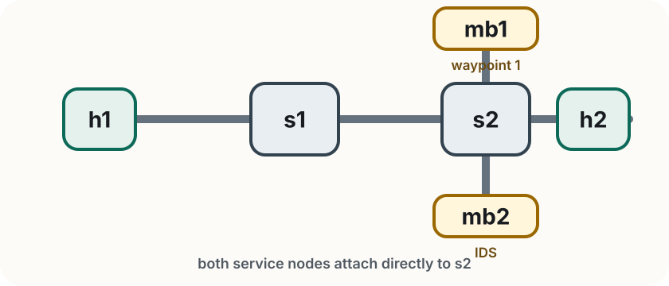

<!-- _class: title -->

<span class="tag">Lab 3</span>

# SRv6 Path Steering
# and Service Function Chaining

Rogers Executive Workshop 3 — Transport Network

---

<!-- _class: divider -->

# Getting Started

The topology and what we are trying to show

---

# Lab 3 at a glance

In this lab you will:

- start a topology with two service waypoints off the direct path
- enable SRv6 on each host and assign Segment IDs
- show that normal routing bypasses both service functions
- program an SRv6 encapsulation route to chain traffic through them
- observe the IDS log tunneled HTTP requests at the second waypoint

> **Goal** Understand how SRv6 steers traffic through an explicit sequence of nodes — without a controller touching the switches.

---

# Lab 3 topology

<div class="topology-figure compact">
  
</div>

| Node | Role                | IPv4     | SRv6 SID |
| ---- | ------------------- | -------- | -------- |
| h1   | Traffic source      | 10.0.0.1 | fc00::1  |
| h2   | Traffic destination | 10.0.0.2 | fc00::2  |
| mb1  | Waypoint 1          | 10.0.0.3 | fc00::b1 |
| mb2  | IDS / waypoint 2    | 10.0.0.4 | fc00::b2 |

> **The key detail** Without SRv6, `h1 → s1 → s2 → h2` completely bypasses `mb1` and `mb2`. SRv6 encap forces the packet to visit both before it reaches `h2`.

---

# Service chain behaviour

Two service nodes sit off the direct path — traffic only visits them if SRv6 steers it there.

**mb1 — waypoint 1**
- first hop in the SRv6 segment list
- forwards the outer SRv6 packet toward `mb2`
- a good place to observe the SRH with `tshark`

**mb2 — IDS (Intrusion Detection System)**
- passively inspects tunneled HTTP requests
- prints `[OK]` for normal requests, `[ALERT]` for suspicious URLs (e.g. `/malware`, `/exploit`)
- always lets traffic pass — it detects but does not block

> **Without the service chain** malicious requests reach `h2` undetected. With SRv6 encap, every request must pass through `mb2` first.

---

<!-- _class: compact -->

# Before you start

**First: clean up Lab 2 completely.**

1. Exit any running Mininet (`Ctrl+D` or `exit` in the Mininet terminal)
2. Run `sudo mn -c` in a terminal
3. Close all Lab 2 terminals

Then open **four fresh terminals**.

**In every terminal, start in the Lab 3 folder:**

```bash
cd ~/labs/lab3
```

Use the terminals like this:

| Terminal           | Purpose                                                        |
| ------------------ | -------------------------------------------------------------- |
| 1 — Mininet        | start topology, run host commands                              |
| 2 — h2 HTTP server | `./run_h2_http_server.sh`                                      |
| 3 — mb2 IDS        | `./run_mb2_ids.sh`                                             |
| 4 — Shell          | `exercises/verify.py`, `./enter_host.sh`                       |

- `sudo` is required for Mininet

---

<!-- _class: compact -->

# Start and verify

Start Mininet in terminal 1. This creates the topology and gives you the CLI you will use for the rest of the lab:

```bash
sudo python3 topology.py
```

Before touching SRv6, confirm the plain network works end to end:

```text
mininet> pingall
```

Then start the HTTP server in terminal 2 so `h2` is ready for the traffic tests that follow:

```bash
./run_h2_http_server.sh
```

> **Why this order?** First prove the baseline network works, then bring up the application, then add SRv6 steering. Lab 3 does not use ONOS — the steering behavior comes from Linux routing on the hosts.

---

<!-- _class: divider -->

# SRv6 Setup

Enable IPv6 SIDs first, then compare before and after steering

---

# Set up SRv6 on every host

Instead of typing the same setup four times, you will use the helper script `configure_srv6.py`. It applies these three steps on each host:

```text
sysctl -w net.ipv6.conf.all.forwarding=1
sysctl -w net.ipv6.conf.all.seg6_enabled=1
sysctl -w net.ipv6.conf.<iface>.seg6_enabled=1
ip -6 addr add <SID>/128 dev <iface>
```

- `forwarding=1` — allows the host to forward IPv6 packets, not just originate them
- `seg6_enabled=1` — tells the Linux kernel to process Segment Routing Headers (SRH)
- `<SID>/128` — assigns the host's Segment ID; this is the address the segment list will reference

> **Every host in the chain needs the same three steps** — the SID address is the only thing that changes.

---

# Apply the same setup to all hosts

Run the helper script to configure all hosts at once. From terminal 4:

```bash
python3 configure_srv6.py
```

It applies the same three-step pattern to every host:

| Host  | SID        |
| ----- | ---------- |
| `h1`  | `fc00::1`  |
| `h2`  | `fc00::2`  |
| `mb1` | `fc00::b1` |
| `mb2` | `fc00::b2` |

> **The script also adds an on-link route for `fc00::/64`** so all SIDs are mutually reachable across the switched topology.

---

# Verify SID reachability

Confirm all SIDs are reachable from `h1` before adding any steering rules:

```text
mininet> h1 ping6 -c 2 fc00::2     # h1 → h2
mininet> h1 ping6 -c 2 fc00::b1    # h1 → mb1
mininet> h1 ping6 -c 2 fc00::b2    # h1 → mb2
```

All three should succeed. If any fail, check that `seg6_enabled` and `forwarding` are set on that host:

```text
mininet> h1 sysctl net.ipv6.conf.all.seg6_enabled
```

> **Note** The application traffic in this lab stays as ordinary IPv4. SRv6 is the outer transport — `encap` wraps the IPv4 packet inside an IPv6+SRH header to steer it through the chain.

---

<!-- _class: divider -->

# Baseline

Before adding an SRv6 tunnel route, confirm plain IPv4 still bypasses the service chain

---

# Confirm the default IPv4 path bypasses mb1 and mb2

SRv6 is enabled on the hosts, but no steering rule has been added yet — traffic still takes the direct `h1 → s1 → s2 → h2` path.

First, start the IDS in terminal 3 so you can see what it captures:

```bash
./run_mb2_ids.sh
```

Then send a suspicious request from `h1`:

```text
mininet> h1 curl http://10.0.0.2/malware
```

> **Expected** `h2` responds and `mb2` prints **nothing** — the request never passed through the IDS. This is the baseline: without SRv6 steering, the service chain is completely invisible to the traffic.

---

<!-- _class: divider -->

# Path Steering

Programming the service chain with SRv6

---

# What changes with SRv6 steering

Before path steering:

```text
h1  ───────────────>  h2
     direct IPv4 path
```

After adding the SRv6 encap route on `h1`:

```text
h1  ──>  mb1  ──>  mb2  ──>  h2
        waypoint    IDS
```

The application request itself does not change:

```text
GET /index.html   to   10.0.0.2
```

> **Only the route on `h1` changes** — `encap` wraps the original IPv4 request in a new outer IPv6+SRH packet and steers it through `mb1` then `mb2` before it reaches `h2`.

---

# Anatomy of the encapsulated packet

Conceptually, the steered packet looks like:

```text
Outer IPv6 header
  src: fc00::1
  current destination: fc00::b1

SRH waypoint list
  1. fc00::b1   (mb1)
  2. fc00::b2   (mb2)
  final destination: fc00::2   (h2)

Inner IPv4 packet
  original destination: 10.0.0.2

Payload
  GET /index.html
```

- at `mb1`, the SRH advances and the packet is forwarded to `mb2`
- at `mb2`, the SRH advances to the final segment `fc00::2`
- at `h2`, the outer SRv6 wrapper is stripped and the original packet is delivered
- the inner HTTP request is unchanged throughout

> **`encap` preserves the original packet** — SRv6 adds an outer IPv6+SRH wrapper that steers the traffic, then disappears at the final destination.

---

# Program the service chain

On `h1`, install the SRv6 encap route that steers traffic through `mb1` then `mb2`:

```text
mininet> h1 ip route add 10.0.0.2 encap seg6 mode encap segs fc00::b1,fc00::b2,fc00::2 dev h1-eth0
```

Verify the route was added:

```text
mininet> h1 ip route show
```

> **Reading the segment list** `fc00::b1,fc00::b2,fc00::2` — visit `mb1` first, then `mb2`, then deliver to `h2`. Any IPv4 traffic from `h1` to `10.0.0.2` will now be wrapped and steered through this chain.

---

<!-- _class: compact -->

# Test the service chain

Send a normal request and watch terminal 3:

```text
mininet> h1 curl http://10.0.0.2/index.html
```

```text
[HH:MM:SS] [mb2 IDS] [OK]    10.0.0.1 → 10.0.0.2 — GET /index.html HTTP/1.1
```

Now send a suspicious one:

```text
mininet> h1 curl http://10.0.0.2/malware
```

```text
[HH:MM:SS] [mb2 IDS] [ALERT] 10.0.0.1 → 10.0.0.2 — GET /malware HTTP/1.1
```

> **Both requests passed through `mb2`** — the IDS can inspect the tunneled HTTP payload and classify it, even though the original traffic is wrapped in an SRv6 outer packet. `h2` still responds in both cases; the IDS detects but does not block.

---

<!-- _class: compact -->

# Inspect the outer SRv6 packet with tshark

From terminal 4, open a shell inside `mb1` and start capturing:

```bash
./enter_host.sh mb1
tshark -i mb1-eth0 -Y "ipv6.routing.type == 4" -V -c 1
```

Then trigger a request from Mininet:

```text
mininet> h1 curl http://10.0.0.2/test
```

Look for the Segment Routing Header in the capture:

```text
Routing Header (Type 4 - Segment Routing)
  Segments Left: 2 or 1
  Last Entry: 2
  Address[0]: fc00::2    ← final destination (h2)
  Address[1]: fc00::b2   ← second waypoint (mb2)
  Address[2]: fc00::b1   ← first waypoint (mb1)
```

> **This is the outer packet** — the SRH is part of the IPv6 transport wrapper. The original IPv4 request to `10.0.0.2` is carried inside it, invisible to the switches.

---

# Remove the route — confirm bypass

Remove the SRv6 steering route:

```text
mininet> h1 ip route del 10.0.0.2
```

Send the same malicious request again:

```text
mininet> h1 curl http://10.0.0.2/malware
```

> **Expected** `h2` responds, but `mb2` prints **nothing** — without the SRv6 route, traffic falls back to the direct path and bypasses the service chain entirely. The IDS never sees the request.

---

<!-- _class: divider -->

# Exercises

Adding the reverse service chain

---

<!-- _class: independent compact -->

# Exercise

The guided section established the forward chain:

**h1 → mb1 → mb2 → h2**

Your goal is to add the reverse:

**h2 → mb2 → mb1 → h1**

Right now `h2` sends replies directly back to `h1`, bypassing the service chain entirely. Install an SRv6 route on `h2` so that return traffic also passes through `mb2` and `mb1`.

---

<!-- _class: independent compact -->

# Exercise — Observe The Problem

From terminal 4, make sure you are in `~/labs/lab3`, then open a shell inside `mb1` and start an ICMP capture:

```bash
./enter_host.sh mb1
tshark -i mb1-eth0 -Y "icmp && ip.addr==10.0.0.1 && ip.addr==10.0.0.2"
```

Then from Mininet send exactly one ping. After it finishes, return to the `tshark` terminal and stop the capture with `Ctrl+C`:

```text
mininet> h1 ping -c 1 10.0.0.2
```

```text
10.0.0.1 -> 10.0.0.2   ICMP Echo (ping) request
```

> **Expected** `mb1` sees the request, but not the reply. That shows the forward path is steered through `mb1`, while the return path still bypasses it.

---

<!-- _class: independent compact -->

# Exercise — Tasks

1. **Fill in the two blanks** in `exercises/reverse_route.sh`, then run:

   ```bash
   sudo bash exercises/reverse_route.sh
   ```

2. **Verify:**

   ```bash
   sudo python3 exercises/verify.py
   ```

> **Stuck?** Compare with `solutions/reverse_route.sh`

---

<!-- _class: independent compact -->

# Troubleshooting

| Symptom                            | Fix                                                            |
| ---------------------------------- | -------------------------------------------------------------- |
| `ping6 fc00::2` fails after setup  | recheck `seg6_enabled` and SID assignment on all hosts         |
| `curl http://10.0.0.2/...` fails   | restart with `./run_h2_http_server.sh`                         |
| IDS log is empty                   | restart with `./run_mb2_ids.sh` before sending traffic         |
| verify shows reverse route missing | check the DESTINATION and SEGS blanks in `reverse_route.sh`    |
| `tshark` shows no SRH              | confirm route uses `mode encap` and the segs include `fc00::1` |

---

<!-- _class: independent compact -->

# Hints

- **Destination** — `h1`'s IPv4 address is `10.0.0.1`
- **Segs order** — for `h2 → mb2 → mb1 → h1`, the list is `fc00::b2,fc00::b1,fc00::1`
- **Re-check with `tshark`** — after `verify.py` passes, repeat the ICMP capture from the earlier slide. This time `mb1` should see both the request and the reply.

---

# Summary

In this lab you:

- showed that normal routing bypasses service functions entirely
- enabled SRv6 on Linux hosts and assigned Segment IDs
- programmed a two-node service chain using SRv6 `encap`
- inspected the outer SRv6 packet in transit with `tshark`
- watched the IDS detect a request tunneled inside the SRv6 wrapper
- confirmed that removing the route immediately bypasses the chain

> **Coming up** Lab 4 automates what you did manually here — the SliceController programs SRv6 routes and combines them with OVS bandwidth reservation to provision complete transport slices.
