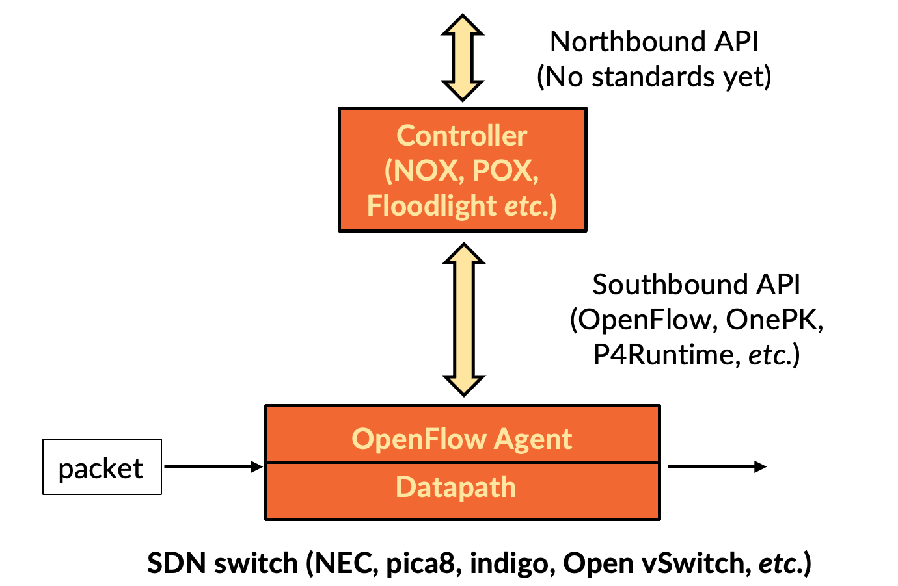
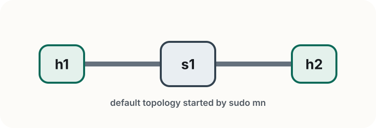
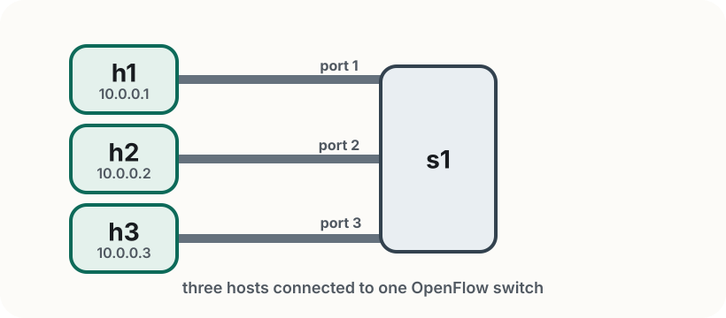

<!-- _class: title -->

<span class="tag">Lab 1</span>

# Programmable Forwarding
# with OVS + Mininet

Rogers Executive Workshop 3 — Transport Network

---

<!-- _class: divider -->

# Getting Started

Mininet, OVS, and your first flow rules

---

# Lab 1 at a glance

In this lab you will:

- start from Mininet's default topology
- observe how OVS behaves with and without flow rules
- install a few OpenFlow rules by hand
- build a simple topology in Python

> **Goal** By the end, you should be able to read any flow rule and identify what it matches, what it does, and how to verify it fired.

---

# SDN and OpenFlow

<div class="slide-figure">
  
</div>

- SDN separates the control plane from the data plane — the controller decides, the switch acts
- OpenFlow is one way to express forwarding rules, but not the only one e.g., **SRv6** encodes the entire path in the packet header, so the source node acts as its own controller


> **The principle matters more than the protocol** — once you understand match → action, you can apply it to any programmable forwarding plane.

---

# Open vSwitch (OVS)

OVS is a software switch that runs on Linux and understands OpenFlow.

- the **datapath** forwards packets at line rate
- the **userspace daemon** manages configuration and communicates with controllers
- in this lab, you program OVS directly from the terminal using `ovs-ofctl` and `ovs-vsctl`

OVS is widely used in production environments:

- **5G core** — virtual switches connect UPF, SMF, and other network functions running as containers or VMs
- **cloud data centres** — hypervisors use OVS to connect VMs and enforce tenant isolation
- **NFV platforms** — OVS provides the underlay fabric that ties virtualised network functions together

> **Think of OVS as the switch you are programming** — the datapath is its hardware, the terminal is your controller.

---

# Mininet

Mininet emulates a network topology on a single machine — hosts, switches, and links all in software.

- hosts run in isolated Linux network namespaces
- switches are OVS instances you can program with OpenFlow
- `sudo mn` starts a default topology: `h1 -- s1 -- h2`
- the CLI lets you run commands on any node: `h1 ping h2`, `s1 ovs-ofctl dump-flows`

> **In this lab** Mininet gives you the network; you decide how it forwards traffic.

---

# Before you start

- work from `~/labs/lab1`
- keep **two terminals open** — one for the Mininet CLI, one for `ovs-ofctl` commands
- all Mininet and OVS commands require `sudo`
- exit the Mininet CLI cleanly with `exit` or `Ctrl+D` — this tears down the topology properly

> **If something looks broken** run `sudo mn -c` to clean up any leftover state before starting again.

---

# Start Mininet

Start the default topology: `sudo mn`

<div class="topology-figure compact">
  
</div>

Mininet creates two hosts (`h1`, `h2`) and one switch (`s1`) connected in a line, then drops you into the CLI: `mininet>`

> **Note** Mininet also starts a default controller — this is what makes `s1` forward traffic before you install any rules.

---

# First Mininet commands

Explore the topology from the Mininet CLI:

```text
mininet> nodes        # list all hosts and switches
mininet> net          # show links between nodes
mininet> dump         # show interface and PID details
```

Run a command inside a specific host by prefixing its name:

```text
mininet> h1 ip addr show
```

> **What to notice** Each host has its own interface (`h1-eth0`, etc.) because Mininet isolates hosts in separate Linux network namespaces — just like containers.

---

# Test connectivity

Ping between hosts and measure bandwidth:

```text
mininet> h1 ping -c 3 h2   # ping h2 from h1
mininet> pingall            # test all host pairs at once
mininet> iperf h1 h2        # measure throughput between h1 and h2
mininet> py h1.IP()         # inspect Mininet objects from the CLI
```

> **Why it works** Pings succeed because Mininet starts with a default learning controller. In the next step, you will remove it — and see what happens when there are no forwarding rules.

---

<!-- _class: divider -->

# OpenFlow and OVS

Programming the data plane

---

# OpenFlow — match + action

Every flow rule has three parts:

**Match** — which packets does this rule apply to?
- any combination of: input port, MAC, IP, VLAN, TCP/UDP port
- OpenFlow 1.3 supports 40+ match fields — you only need a few today ([reference](https://www.openvswitch.org/support/dist-docs/ovs-ofctl.8.txt))

**Action** — what to do with matched packets?
- `output:N` — forward out port N
- `output:FLOOD` — send out all ports except the input port
- `drop` — discard silently

**Counter** — `n_packets` and `n_bytes` are updated automatically for every rule

> **Think of it as a policy statement** — "if a packet looks like *this*, do *that*, and count how many times it happened."

---

# A concrete flow-table entry

Here is what a flow rule looks like in OVS:

```text
idle_timeout=0, ip, nw_src=10.0.0.1, nw_dst=10.0.0.2, actions=output:2
```

- **match** — `ip,nw_src=10.0.0.1,nw_dst=10.0.0.2` selects packets from h1 to h2
- **action** — `actions=output:2` forwards them out port 2
- **`idle_timeout=0`** — rule never expires; without it OVS silently removes idle rules after ~10 s

> Always include `idle_timeout=0` in every rule you install — you will see this in practice shortly.

---

<!-- _class: divider -->

# Mininet Python API

Building topologies in code

---

# A simple topology in Python

Make sure you are in `~/labs/lab1/`, then open `simple_topo.py` — two hosts connected to one switch:

```python
h1 = net.addHost("h1", ip="10.0.0.1/24")
h2 = net.addHost("h2", ip="10.0.0.2/24")
s1 = net.addSwitch("s1", cls=OVSSwitch, protocols="OpenFlow13")
# links: h1 → s1, h2 → s1 — 10 Mbps, 5 ms delay
net.staticArp()
```

**`staticArp()`** fills in each host's ARP table in advance — the switch never sees ARP broadcasts, so IP rules alone are enough to forward traffic.

---

# Start and observe

From terminal 1 (inside `~/labs/lab1/`), start the topology:

```bash
sudo python3 simple_topo.py
```

From the Mininet CLI — connectivity fails because there are no rules yet:

```text
mininet> pingall     # all fail
```

From **terminal 2**, inspect the empty flow table:

```bash
sudo ovs-ofctl -O OpenFlow13 dump-flows s1
```

The output is empty — no rules, no forwarding.

---

# Add flow rules

> All `ovs-ofctl` commands run in **terminal 2** — never from inside the Mininet CLI.

Check which host is on which port, then install two rules:

```text
mininet> net
```

```bash
sudo ovs-ofctl -O OpenFlow13 add-flow s1 \
  "idle_timeout=0,ip,nw_src=10.0.0.1,nw_dst=10.0.0.2,actions=output:2"
sudo ovs-ofctl -O OpenFlow13 add-flow s1 \
  "idle_timeout=0,ip,nw_src=10.0.0.2,nw_dst=10.0.0.1,actions=output:1"
```

From the Mininet CLI, verify:

```text
mininet> h1 ping -c 3 h2    # now works
```

---

# Verify and reset

In terminal 2, confirm the rules fired:

```bash
sudo ovs-ofctl -O OpenFlow13 dump-flows s1
```

```text
cookie=0x0, duration=8.1s, n_packets=3, n_bytes=294,
  idle_timeout=0, ip,nw_src=10.0.0.1,nw_dst=10.0.0.2 actions=output:2
```

`n_packets=3` confirms the rule matched. To clear all rules and try again:

```bash
sudo ovs-ofctl -O OpenFlow13 del-flows s1
```

---

<!-- _class: divider -->

# Exercises

Programming flow rules

---

<!-- _class: independent -->

# Exercise 1

The topology is already built for you. See `~/labs/lab1/exercises/topology.py`.

<div class="topology-figure compact">
  
</div>

Your goal: make **h1 ↔ h2** work by adding exactly **two flow rules** using `ovs-ofctl` commands.
h3 is connected but not used yet. Confirm port numbers with `net` in the Mininet CLI.

> **Hint** Treat the two directions separately. In the exercise scripts, match `in_port`, `nw_src`, and `nw_dst` so each rule applies only to the traffic you intend.

---

<!-- _class: independent -->

# Exercise 1 — Tasks

0. **If Mininet is still running, exit it first** (`Ctrl+D` or `exit`), then clean up: `sudo mn -c`
1. **Start topology** (terminal 1): `sudo python3 exercises/topology.py`
2. **Check ports** (Mininet CLI): `net`
3. **Fill in the two `TODO` rules** in `exercises/part1/add_rules.sh`, then run: `sudo bash exercises/part1/add_rules.sh`
4. **Verify:** `sudo python3 exercises/part1/verify.py`

> **Stuck?** Compare with `solutions/part1/add_rules.sh`

---

<!-- _class: independent -->

# Take a moment

Before moving on to Exercise 2:

- does `h1 ping -c 3 h2` succeed from the Mininet CLI?
- does `dump-flows s1` show `n_packets` > 0 on both your rules?
- compare your solution with `solutions/part1/add_rules.sh`

`n_packets` should increase after each successful ping.

---

<!-- _class: independent -->

# Exercise 2

Same topology. Extend your rules so:

- `h1` ↔ `h3` also works
- `h2` and `h3` **cannot** reach each other

The h1 ↔ h2 rules from Exercise 1 are already pre-filled as a reference.  
Add two more rules for h1 ↔ h3.

> **Hint** You do not need an explicit `drop` rule for `h2 ↔ h3`. In OVS, packets that do not match any rule are dropped automatically.

---

<!-- _class: independent -->

# Exercise 2 — Tasks

Keep the topology running from Exercise 1 — no restart needed.

1. **Open** `exercises/part2/add_rules.sh` — h1 ↔ h2 rules are pre-filled as reference
2. **Fill in the two `TODO` rules** for h1 ↔ h3, then run: `sudo bash exercises/part2/add_rules.sh`
3. **Add a comment** in the script: why can't h2 reach h3?
4. **Verify:** `sudo python3 exercises/part2/verify.py`

> **Stuck?** Compare with `solutions/part2/add_rules.sh`

---

<!-- _class: independent compact -->

# Troubleshooting

**`ovs-ofctl` says `version negotiation failed`.**
Add `-O OpenFlow13` to every `ovs-ofctl` command.

**I added rules, but ping still fails.**
Check the port mapping with `net` or `sudo ovs-ofctl -O OpenFlow13 show s1`. Make sure you installed both directions and that `in_port`, `nw_src`, and `nw_dst` match the traffic you intend.

**My rules disappear after a short pause.**
Add `idle_timeout=0` to every `add-flow` rule so OVS does not age it out.

**Exercise 2 still lets `h2` and `h3` talk.**
Your matches are too broad. Only install rules for `h1 ↔ h2` and `h1 ↔ h3`; packets without a matching rule are dropped automatically.

**Mininet or the verifier behaves strangely after a previous run.**
Exit Mininet, run `sudo mn -c`, then restart the topology from `~/labs/lab1`.

---

# Summary

In this lab you:

- observed that OVS drops all traffic without explicit rules
- installed match + action rules and verified them with `dump-flows` counters
- built a custom topology in Python with controlled bandwidth and delay
- engineered selective connectivity — some paths allowed, some blocked

> **This is the core idea we build on in later labs** — first you will program forwarding directly; by Lab 4, a transport slice controller will take a higher-level request and realize it using the same underlying mechanisms.

**Next in the schedule** is Concepts 2, where you will connect this hands-on work to the OpenFlow model, controllers, and intents. After that, Lab 2 moves from manual rules to controller-based connectivity with ONOS.
