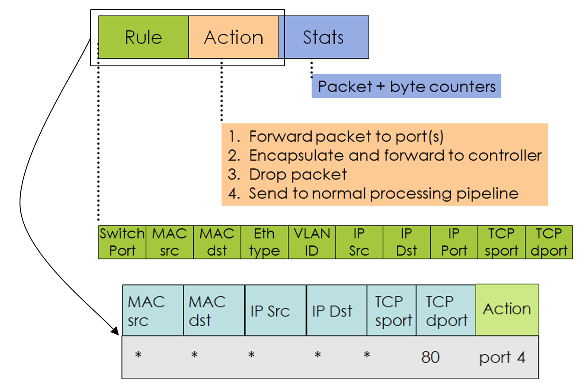
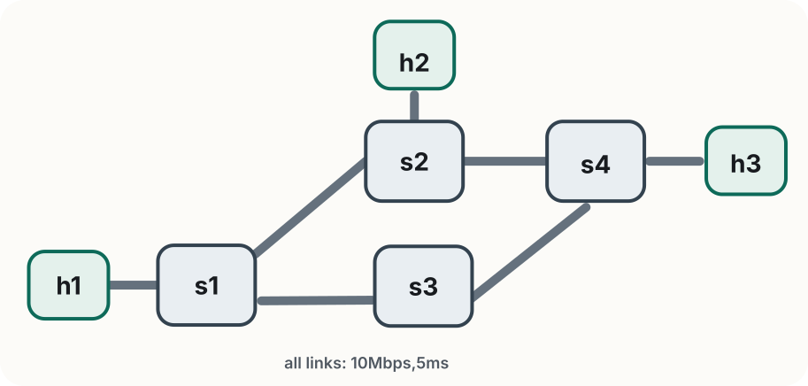

<!-- _class: title -->

<span class="tag">Lab 1</span>

# Programmable Forwarding
# with OVS + Mininet

Rogers Executive Workshop 3 — Transport Network

---

<!-- _class: divider -->

# Getting Started

Mininet, OVS, and your first flow rules

---

# Lab 1 at a glance

In this lab you will:

- start from Mininet's default topology
- observe how OVS behaves with and without flow rules
- install a few OpenFlow rules by hand
- build a simple topology in Python

> **Goal** By the end, you should be able to read any flow rule and identify what it matches, what it does, and how to verify it fired.

---

# SDN and OpenFlow

<div class="slide-figure">
  
</div>

- SDN separates the control plane from the data plane — the controller decides, the switch acts
- OpenFlow is one way to express forwarding rules, but not the only one e.g., **SRv6** encodes the entire path in the packet header, so the source node acts as its own controller


> **The principle matters more than the protocol** — once you understand match → action, you can apply it to any programmable forwarding plane.

---

# Open vSwitch (OVS)

OVS is a software switch that runs on Linux and understands OpenFlow.

- the **datapath** forwards packets at line rate
- the **userspace daemon** manages configuration and communicates with controllers
- in this lab, you program OVS directly from the terminal using `ovs-ofctl` and `ovs-vsctl`

OVS is widely used in production environments:

- **5G core** — virtual switches connect UPF, SMF, and other network functions running as containers or VMs
- **cloud data centres** — hypervisors use OVS to connect VMs and enforce tenant isolation
- **NFV platforms** — OVS provides the underlay fabric that ties virtualised network functions together

> **Think of OVS as the switch you are programming** — the datapath is its hardware, the terminal is your controller.

---

# Mininet

Mininet emulates a network topology on a single machine — hosts, switches, and links all in software.

- hosts run in isolated Linux network namespaces
- switches are OVS instances you can program with OpenFlow
- `sudo mn` starts a default topology: `h1 -- s1 -- h2`
- the CLI lets you run commands on any node: `h1 ping h2`, `s1 ovs-ofctl dump-flows`

> **In this lab** Mininet gives you the network; you decide how it forwards traffic.

---

# Before you start

- work from `~/labs/lab1`
- keep **two terminals open** — one for the Mininet CLI, one for `ovs-ofctl` commands
- all Mininet and OVS commands require `sudo`
- exit the Mininet CLI cleanly with `exit` or `Ctrl+D` — this tears down the topology properly

> **If something looks broken** run `sudo mn -c` to clean up any leftover state before starting again.

---

# Start Mininet

Start the default topology:

```bash
sudo mn
```

<div class="topology-figure compact">
  
</div>

Mininet creates two hosts (`h1`, `h2`) and one switch (`s1`) connected in a line, then drops you into the CLI:

```text
mininet>
```

> **Note** Mininet also starts a default controller — this is what makes `s1` forward traffic before you install any rules.

---

# First Mininet commands

Explore the topology from the Mininet CLI:

```text
mininet> nodes        # list all hosts and switches
mininet> net          # show links between nodes
mininet> dump         # show interface and PID details
```

Run a command inside a specific host by prefixing its name:

```text
mininet> h1 ip addr show
```

> **What to notice** Each host has its own interface (`h1-eth0`, etc.) because Mininet isolates hosts in separate Linux network namespaces — just like containers.

---

# Test connectivity

Ping between hosts and measure bandwidth:

```text
mininet> h1 ping -c 3 h2   # ping h2 from h1
mininet> pingall            # test all host pairs at once
mininet> iperf h1 h2        # measure throughput between h1 and h2
mininet> py h1.IP()         # inspect Mininet objects from the CLI
```

> **Why it works** Pings succeed because Mininet starts with a default learning controller. In the next step, you will remove it — and see what happens when there are no forwarding rules.

---

# Built-in Mininet topologies

Mininet can start larger topologies without writing any Python:

```bash
sudo mn --topo=single        # one switch, multiple hosts
sudo mn --topo=linear,3      # three switches in a line, each with one host
sudo mn --topo=tree,depth=2,fanout=2   # binary tree: 2 core, 4 edge switches
```

Try `pingall` after each one — notice how the default controller handles a more complex topology.

> **Coming up** After exploring the built-ins, you will define your own topology in Python and have full control over how it is wired.

---

<!-- _class: divider -->

# OpenFlow and OVS

Programming the data plane

---

# OpenFlow — match + action

Every flow rule has three parts:

**Match** — which packets does this rule apply to?
- any combination of: input port, MAC, IP, VLAN, TCP/UDP port
- OpenFlow 1.3 supports 40+ match fields — you only need a few today ([reference](https://www.openvswitch.org/support/dist-docs/ovs-ofctl.8.txt))

**Action** — what to do with matched packets?
- `output:N` — forward out port N
- `output:FLOOD` — send out all ports except the input port
- `drop` — discard silently

**Counter** — `n_packets` and `n_bytes` are updated automatically for every rule

> **Think of it as a policy statement** — "if a packet looks like *this*, do *that*, and count how many times it happened."

---

# Example flow-table entry

<div class="slide-figure">
  
</div>

- **priority** — when multiple rules match, the highest priority wins
- **match fields** — only packets that satisfy all fields are selected
- **actions** — executed in order; a rule with no actions drops the packet

> **This is what you are writing** when you run `ovs-ofctl add-flow` in the exercises.

---

# OVS command reference

This is your controller. Run these from your second terminal:

```bash
# understand the switch before touching it
sudo ovs-ofctl -O OpenFlow13 show s1         # port numbers and capabilities
sudo ovs-ofctl -O OpenFlow13 dump-flows s1   # current rules — match, action, counters
sudo ovs-ofctl -O OpenFlow13 dump-ports s1   # per-port traffic statistics

# install and remove rules
sudo ovs-ofctl -O OpenFlow13 add-flow s1 <spec>   # push a rule to the switch
sudo ovs-ofctl -O OpenFlow13 del-flows s1         # clear all rules
```

> **`dump-flows` is your best friend** — use it to verify that a rule fired and the counter incremented, which is the goal for every exercise today.

---

# Observe switches with no rules

Restart Mininet with a two-switch topology and no controller:

```bash
sudo mn -c
sudo mn --topo=linear,2 --controller=none --switch ovs,protocols=OpenFlow13
```

Try to ping:

```
mininet> h1 ping -c 3 h2     # fails
mininet> pingall              # all fail
```

Inspect the empty flow tables:

```bash
sudo ovs-ofctl -O OpenFlow13 dump-flows s1
sudo ovs-ofctl -O OpenFlow13 dump-flows s2
```

> **What you should observe** Without flow rules, switches drop all traffic. No rule means no forwarding.

---

# Add flow rules manually

Install bidirectional rules to connect `h1` and `h2` across `s1 → s2`:

```bash
# s1: forward h1→h2 traffic toward s2, return traffic back to h1
sudo ovs-ofctl -O OpenFlow13 add-flow s1 \
  ip,nw_src=10.0.0.1,nw_dst=10.0.0.2,actions=output:2
sudo ovs-ofctl -O OpenFlow13 add-flow s1 \
  ip,nw_src=10.0.0.2,nw_dst=10.0.0.1,actions=output:1

# s2: mirror rules — traffic must be forwarded on both switches
sudo ovs-ofctl -O OpenFlow13 add-flow s2 \
  ip,nw_src=10.0.0.1,nw_dst=10.0.0.2,actions=output:2
sudo ovs-ofctl -O OpenFlow13 add-flow s2 \
  ip,nw_src=10.0.0.2,nw_dst=10.0.0.1,actions=output:1
```

> **Check port numbers first** Run `net` in the Mininet CLI to see how nodes are wired, then confirm with `show s1` and `show s2` before applying the rules.

---

# Test connectivity and inspect counters

From the Mininet CLI, verify the path works:

```text
mininet> h1 ping -c 5 h2
mininet> iperf h1 h2
```

Then check that your rules fired — from your second terminal:

```bash
sudo ovs-ofctl -O OpenFlow13 dump-flows s1
```

You should see `n_packets` and `n_bytes` incrementing:

```text
cookie=0x0, duration=12.3s, n_packets=5, n_bytes=490,
  ip,nw_src=10.0.0.1,nw_dst=10.0.0.2 actions=output:2
```

> **If `n_packets` is 0** the rule didn't match — double-check the IP addresses and port numbers against `net` and `show`.

---

<!-- _class: divider -->

# Mininet Python API

Building topologies in code

---

# A minimal topology in Python

Create `simple_topo.py`:

```python
from mininet.net import Mininet
from mininet.node import OVSSwitch
from mininet.link import TCLink
from mininet.cli import CLI

net = Mininet()

h1 = net.addHost('h1', ip='10.0.0.1/24')
h2 = net.addHost('h2', ip='10.0.0.2/24')
s1 = net.addSwitch('s1', cls=OVSSwitch, protocols='OpenFlow13')

net.addLink(h1, s1, cls=TCLink, bw=10, delay='5ms')  # 10 Mbps, 5ms RTT
net.addLink(h2, s1, cls=TCLink, bw=10, delay='5ms')

net.start()
net.staticArp()  # pre-populate ARP so IP rules are enough — no ARP flooding needed
CLI(net)
net.stop()
```

<!-- > **`TCLink`** lets you set bandwidth and delay per link — useful for simulating realistic network conditions. -->

---

# Run it and add flow rules

Start the topology — `pingall` will fail until you install rules:

```bash
sudo python3 simple_topo.py
```

From your second terminal, check ports then add rules:

```bash
sudo ovs-ofctl -O OpenFlow13 show s1
sudo ovs-ofctl -O OpenFlow13 add-flow s1 \
  ip,nw_src=10.0.0.1,nw_dst=10.0.0.2,actions=output:2
sudo ovs-ofctl -O OpenFlow13 add-flow s1 \
  ip,nw_src=10.0.0.2,nw_dst=10.0.0.1,actions=output:1
```

```text
mininet> h1 ping -c 3 h2    # now works
```

> **Use this structure** Every topology follows the same pattern: add nodes -> add links -> `start()` -> interact -> `stop()`.

---

<!-- _class: independent -->

# Independent Challenge

Build the topology below and implement the required connectivity:

<div class="topology-figure compact">
  
</div>

All links: **10 Mbps, 5 ms delay**

- `h1` ↔ `h2` must communicate
- `h1` ↔ `h3` must communicate
- `h2` and `h3` **cannot** reach each other

---

<!-- _class: independent -->

# Your tasks

1. **Complete the topology** in `topology_starter.py`, then start it:
  ```bash
  sudo python3 topology_starter.py
  ```
2. **Add flow rules** in `install_rules.sh`, then apply them from your second terminal:
  ```bash
  sudo bash install_rules.sh
  ```
3. **Verify** your work:
  ```bash
  sudo python3 verify_challenge.py
  ```
4. **Explain** in a comment: which missing rule prevents `h2` ↔ `h3`?

> **Stuck?** Compare with `solutions/topology_solution.py` and `solutions/install_rules_solution.sh`

---

<!-- _class: independent -->

# Troubleshooting

| Symptom | Fix |
|---|---|
| `h3 is missing a host link` | topology TODOs are still incomplete |
| `version negotiation failed` | add `-O OpenFlow13` to your command |
| ping fails after adding rules | run `dump-flows` — check `n_packets` on each switch along the path |
| rules keep disappearing | add `idle_timeout=0` to your `add-flow` commands |

---

<!-- _class: independent -->

# Hints

- **Port numbers** — run `net` in the Mininet CLI, then `ovs-ofctl show <switch>` to confirm
- **Multi-link switches** — use `in_port` to avoid ambiguity: `ip,in_port=1,nw_src=...,actions=output:2`
- **`h2` ↔ `h3` isolation** — no explicit `drop` rule needed; unmatched packets are dropped automatically
- **One valid path plan** — `s1 → s2` for `h1 ↔ h2`, and `s1 → s3 → s4` for `h1 ↔ h3`

---

<!-- _class: independent -->

# Stretch challenge

After your main solution works, reroute `h1 ↔ h3` over the alternate branch.

- make `h1 ↔ h3` work via `s1 → s3 → s4`
- then reroute it via `s1 → s2 → s4`
- keep `h1 ↔ h2` working throughout
- use `dump-flows` counters to confirm which switches are carrying the traffic

> **The forwarding rules change; the connectivity does not** — this is path engineering in miniature.

Reference: `solutions/install_rules_stretch.sh`

---

# Summary

In this lab you:

- observed that OVS drops all traffic without explicit rules
- installed match + action rules and verified them with `dump-flows` counters
- built a custom topology in Python with controlled bandwidth and delay
- engineered selective connectivity — some paths allowed, some blocked

> **The same principle applies at scale** — whether it's OpenFlow rules on OVS or SRv6 segment lists in a 5G transport network, the forwarding plane does exactly what you tell it.

**Next in the schedule** is Concepts 2, where you will connect this hands-on work to the OpenFlow model, controllers, and intents. After that, Lab 2 moves from manual rules to controller-based connectivity with ONOS.
