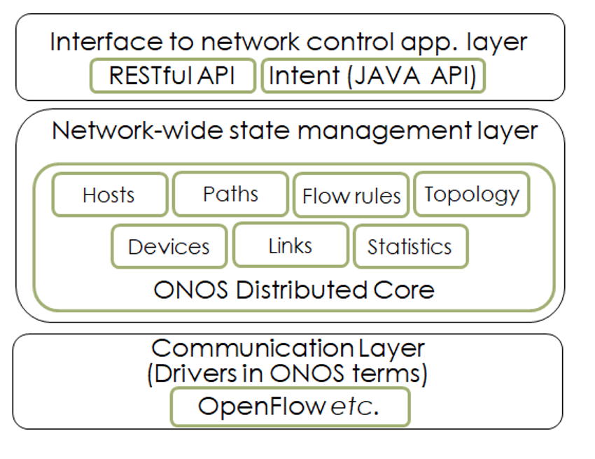
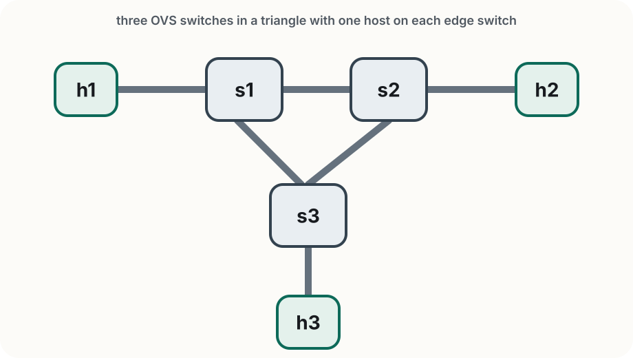
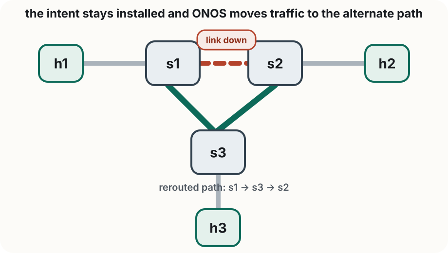

<!-- _class: title -->

<span class="tag">Lab 2</span>

# Controller-Based Connectivity
# with ONOS

Rogers Executive Workshop 3 — Transport Network Programmability

---

<!-- _class: divider -->

# Getting Started

Connecting Mininet to ONOS

---

# Lab 2 at a glance

In this lab you will:

- connect a triangle topology to ONOS
- explore devices, links, hosts, and flows from the ONOS CLI
- query ONOS from Python through the REST API
- install host intents and observe automatic flow-rule installation
- watch ONOS reroute traffic after a link failure

> **What to focus on** In Lab 1 you were the control plane. In Lab 2, ONOS takes over and reacts to the network for you.

---

# From Lab 1 to Lab 2

In Lab 1 you installed flow rules manually with `ovs-ofctl`.

Today ONOS does that work automatically:

|               | Lab 1          | Lab 2              |
| ------------- | -------------- | ------------------ |
| Flow rules    | You write them | ONOS installs them |
| Topology view | You infer it   | ONOS discovers it  |
| Link failure  | Traffic stops  | ONOS reroutes      |
| Control plane | You            | ONOS               |

> **Keep this contrast in mind** In this lab, you ask for connectivity and observe how ONOS turns that into switch behavior.

---

# Where ONOS Fits

<div class="slide-figure">
  
</div>

- ONOS sits between applications and the network devices
- applications express policy through ONOS APIs
- ONOS discovers topology and programs switches through OpenFlow
- intents let you describe *what* you want without specifying every rule yourself

---

# Triangle topology

<div class="topology-figure compact">
  
</div>

- `s1`, `s2`, and `s3` form a triangle
- `h1`, `h2`, and `h3` connect at the edge
- for this lab, focus on `h1`, `h2`, and the alternate path through `s3`

> **What matters here** This topology lets you observe ONOS discovery, automatic forwarding, and rerouting after a link failure.

---

# Before you start

For this lab:

- work from `~/labs/lab2`
- keep at least four terminals open
- make sure Docker and Mininet commands run with `sudo` where needed
- use `Ctrl+D` or `exit` to leave the Mininet CLI cleanly

You will use:

- one terminal for Mininet
- one terminal for the ONOS CLI
- one regular shell for lab scripts such as `preflight_check.py` and `lab2_skeleton.py`
- one regular shell for the checker, `curl`, and `ovs-ofctl`

---

# Check ONOS

Make sure the ONOS container is running:

```bash
docker ps | grep onos
```

If ONOS is stopped, start it:

```bash
docker start onos
```

If `docker start onos` fails because the container does not exist, ask the instructor to rerun the ONOS setup playbook. The workshop image normally creates the container with ports `6653`, `8101`, and `8181` already published.

Then wait about 30 seconds and test the REST API:

```bash
curl -u onos:rocks http://localhost:8181/onos/v1/devices
```

> **You should see** A JSON response. An empty device list is fine at this point.

---

# Start the topology

Start Mininet connected to ONOS:

```bash
sudo python3 triangle_topology.py --onos
```

You should land in the Mininet CLI:

```text
mininet>
```

> **What `--onos` does** It connects each OVS switch to ONOS as a remote OpenFlow controller on port `6653`.

For the first part of the lab, pay attention to:

- which switches and links ONOS discovers
- when hosts appear in ONOS
- what changes after you activate forwarding

---

# Connect to the ONOS CLI

In a second terminal, connect to the ONOS Karaf CLI:

```bash
ssh -p 8101 -o HostKeyAlgorithms=+ssh-rsa onos@localhost
# password: rocks
```

List the active applications:

```text
onos> apps -a -s
```

> **You will use the CLI for** app activation, topology inspection, and intent inspection.

---

# Activate the required apps

Turn on the ONOS apps needed for the first part of this lab:

```text
onos> app activate org.onosproject.openflow
onos> app activate org.onosproject.fwd
```

Then confirm the switches are visible:

```text
onos> devices
```

> **You should see** Three devices, each in the `ACTIVE` state. If the list is empty, wait a few seconds and try again.

> **Why activate `fwd` now** It makes the first discovery and connectivity checks work cleanly. You will turn it off before the intent demo.

---

# Explore topology from the ONOS CLI

Start with these CLI commands:

```text
onos> devices
onos> ports
onos> links
onos> hosts
onos> flows
```

At this point `hosts` may still be empty. Now trigger host discovery from Mininet:

```text
mininet> pingall
```

Then check hosts again:

```text
onos> hosts
```

> **What this shows** ONOS learns switches and links first, then learns hosts after traffic appears.

---

# Inspect reactive forwarding

With `fwd` active, test connectivity from Mininet:

```text
mininet> h1 ping -c 3 h2
mininet> pingall
```

Check what ONOS installed:

```text
onos> flows
```

Run this in your regular shell, not inside `mininet>` or `onos>`:

```bash
sudo ovs-ofctl -O OpenFlow13 dump-flows s1
```

> **What you should observe** Connectivity works even though you never typed `ovs-ofctl add-flow` yourself.

---

# Intents: what, not how

ONOS supports **intents**: high-level connectivity requests.

Instead of saying:

> install these exact flow rules on these exact switches

you say:

> connect host A to host B

ONOS then:

- computes a path
- installs flow rules automatically
- recomputes if the topology changes

---

# Turn off reactive forwarding

Before testing intents, turn off the earlier reactive-forwarding app:

```text
onos> app deactivate org.onosproject.fwd
```

Keep the same Mininet topology running.

> **Do not restart Mininet here** Restarting resets the host-side state and can make the intent demo look broken even when the intent rules are installed correctly.

> **Why this helps** You stop adding new `fwd` rules, but keep the host discovery and traffic context from the earlier steps.

---

# Install a host intent

First confirm ONOS still knows the hosts:

```text
onos> hosts
```

Then install a host-to-host intent:

```text
onos> add-host-intent <h1-id> <h2-id>
onos> intents -i
```

Verify connectivity:

```text
mininet> h1 ping -c 3 h2
```

> **Important** Install the host intent in the same Mininet session you used for the forwarding demo.

> **What this shows** The intent expresses the desired connectivity, and ONOS handles the switch programming.

---

# Intent preserves connectivity

<div class="topology-figure compact">
  
</div>

- the host intent still says "connect `h1` to `h2`"
- when the direct `s1-s2` link fails, ONOS recomputes the path
- traffic continues over `s1 -> s3 -> s2` without changing the intent itself

> **What changes** The path and flow rules change. The intent does not.

---

# Path before failure

With the host intent already working between `h1` and `h2`, confirm the current path:

```text
mininet> h1 ping -c 3 h2
onos> paths of:0000000000000001 of:0000000000000002
```

Expected path:

```text
of:0000000000000001/2-of:0000000000000002/2; cost=1.0
```

> **What this shows** The intent is using the direct `s1 -> s2` path before any failure.

---

# Tear down the direct link

Disable the `s1-s2` link, then check the path again:

```text
mininet> link s1 s2 down
mininet> h1 ping -c 5 h2
onos> paths of:0000000000000001 of:0000000000000002
```

Now observe ONOS:

```text
onos> links
onos> intents -i
onos> flows
```

Expected path while the link is down:

```text
of:0000000000000001/3-of:0000000000000003/3==>of:0000000000000003/2-of:0000000000000002/3; cost=2.0
```

> **What this shows** The intent stays installed, but ONOS recomputes the path and moves traffic over `s1 -> s3 -> s2`.

---

# Restore the direct path

Bring the direct link back and confirm ONOS returns to the shorter path:

```text
mininet> link s1 s2 up
onos> paths of:0000000000000001 of:0000000000000002
```

Expected path after recovery:

```text
of:0000000000000001/2-of:0000000000000002/2; cost=1.0
```

From OVS, inspect rules on the alternate switch while the failure is active:

Run this in your regular shell, not inside `mininet>` or `onos>`:

```bash
sudo ovs-ofctl -O OpenFlow13 dump-flows s3
```

> **What changes** The path and flow rules change. The intent does not.

---

# List and remove intents

List the installed intents:

```text
onos> intents -i
```

Use the `appId` and `id` from that output to remove one:

```text
onos> remove-intent org.onosproject.cli 0x0
onos> intents -i
```

> **What to check** After removal, the host intent should disappear from the installed list.

---

<!-- _class: divider -->

# REST API

Query ONOS first with `curl`, then from Python

---

# Start with `curl`

You can query the ONOS REST API directly from your regular shell:

```text
Base URL:  http://localhost:8181/onos/v1
Auth:      onos / rocks
```

Try:

```bash
curl -u onos:rocks http://localhost:8181/onos/v1/devices
```

Useful endpoints:

| Endpoint            | Returns                |
| ------------------- | ---------------------- |
| `/devices`          | switches               |
| `/links`            | discovered links       |
| `/hosts`            | discovered hosts       |
| `/flows/<deviceId>` | flow rules on a switch |
| `/intents`          | installed intents      |

---

# Add a flow rule with `curl`

Use the example template in `flow_rule_template.json`, then POST it to a device:

```bash
curl -u onos:rocks -X POST \
  -H 'Content-Type: application/json' \
  http://localhost:8181/onos/v1/flows/of:0000000000000001 \
  -d @flow_rule_template.json
```

To verify the rule was added, check ONOS and OVS:

```text
onos> flows
```

Run this in your regular shell:

```bash
sudo ovs-ofctl -O OpenFlow13 dump-flows s1
```

> **What to look for** You should see a new flow entry on `s1` that matches the fields from `flow_rule_template.json`.

---

# Remove a flow rule with the REST API

To remove a rule, you need:

- the device ID
- the flow ID on that device

First inspect the flows:

```bash
curl -u onos:rocks http://localhost:8181/onos/v1/flows/of:0000000000000001
```

Then delete the specific flow:

```bash
curl -u onos:rocks -X DELETE \
  http://localhost:8181/onos/v1/flows/of:0000000000000001/<flowId>
```

> **Why this matters** Your Lab 2 app will use the same two ideas: POST new rules when a path is chosen, then DELETE old rules when the path changes.

---

# Query devices from Python

Use the example script `query_topology.py`:

```python
import requests

BASE = 'http://localhost:8181/onos/v1'
AUTH = ('onos', 'rocks')

r = requests.get(f'{BASE}/devices', auth=AUTH)
devices = r.json()['devices']

for d in devices:
    print(d['id'], d['type'], d['available'])
```

Run it:

```bash
python3 query_topology.py
```

> **You should see** Three device IDs, each with `available` set to `True`.

---

# Query links and hosts

The lab folder also includes `query_hosts.py`:

```python
import requests

BASE = 'http://localhost:8181/onos/v1'
AUTH = ('onos', 'rocks')

links = requests.get(f'{BASE}/links', auth=AUTH).json()['links']
print(f"{len(links)} links")

hosts = requests.get(f'{BASE}/hosts', auth=AUTH).json()['hosts']
for h in hosts:
    print(h['id'], h['ipAddresses'], h['locations'][0]['elementId'])
```

> **Before running this** Use `pingall` once so ONOS has discovered all hosts.

> **What you should see** The host entries should include IP addresses, not just MAC addresses and locations.

---

# Add the same flow rule from Python

The lab folder also includes `add_flow_rule.py`:

```text
python3 add_flow_rule.py
```

Then verify the rule the same way:

```text
onos> flows
```

Run this in your regular shell:

```bash
sudo ovs-ofctl -O OpenFlow13 dump-flows s1
```

> **Why this matters** Your Lab 2 app will use the same REST operation, but it will build the rule dynamically instead of loading a fixed template.

---

<!-- _class: divider -->

# Independent Challenge

Building a small controller-side application

---

<!-- _class: independent -->

# What You Will Build

In this challenge, you will write a small ONOS-facing Python app that:

- finds two hosts by IP address
- asks ONOS for the current shortest path
- installs flow rules directly through the REST API
- monitors for link failure
- recomputes and reinstalls rules after a failure

> **Key difference from the earlier slides** Here you are not using intents. Your Python app is acting like a small controller application.

---

<!-- _class: independent -->

# Keep These Open

During the independent challenge, keep these terminals open:

1. Mininet
   Use this for `pingall`, `link s1 s2 down`, and manual ping checks.
2. ONOS CLI
   Use this for `links`, `hosts`, `flows`, and `paths`.
3. Your app
   Run `python3 lab2_skeleton.py 10.0.0.1 10.0.0.2` here.
4. Checker / shell tools
   Run `python3 preflight_check.py`, `sudo python3 verify_lab2.py ...`, `curl`, and `ovs-ofctl` here.

> **Why this helps** You can keep the network, controller, app, and checks visible at the same time.

---

<!-- _class: independent -->

# Files You Will Use

Use these files for the challenge:

- `preflight_check.py` confirms ONOS is ready for the challenge
- `query_topology.py`, `query_hosts.py`, and `inspect_path.py` are example helpers
- `lab2_skeleton.py` is your starter application
- `verify_lab2.py` checks the challenge behavior
- `flow_rule_template.json` shows the JSON shape for a flow rule
- `solutions/lab2_solution.py` is the reference solution

---

<!-- _class: independent -->

# Get Ready

Before you run `lab2_skeleton.py`, check readiness with:

```text
python3 preflight_check.py
```

It confirms:

- ONOS is reachable
- switches, links, and host IPs are visible
- `paths` returns a route between the endpoint switches

If it fails:

- rerun `pingall` if host IPs are missing
- check `links` and `ports` if `paths` is empty

> **Rule of thumb** The challenge works only after ONOS knows the links, the hosts, and at least one path between the two endpoint switches.

---

<!-- _class: independent -->

# How To Think About It

Break the challenge into five milestones:

1. Find the two hosts in ONOS.
2. Ask ONOS for the current path between them.
3. Install flow rules on the switches along that path.
4. Detect when a link on that path fails.
5. Remove the old rules and install new ones for the new path.

> **How we will approach it** The next two slides walk through milestones 1 and 2 together. Then your own code will handle milestones 3, 4, and 5.

---

<!-- _class: independent -->

# Step 1: Find Hosts

First, use `/hosts` to answer two questions:

- what is the ONOS host ID for `10.0.0.1` and `10.0.0.2`?
- which switch is each host attached to?

You can reuse `query_hosts.py`, or inspect the same logic below:

```python
import requests

BASE = 'http://localhost:8181/onos/v1'
AUTH = ('onos', 'rocks')

hosts = requests.get(f'{BASE}/hosts', auth=AUTH).json()['hosts']
for h in hosts:
    print(h['id'], h['ipAddresses'], h['locations'][0]['elementId'])
```

> **What to look for** Find the entries for `10.0.0.1` and `10.0.0.2`, then note their host IDs and attachment switches.

---

<!-- _class: independent -->

# Step 2: Inspect The Path

Then use those attachment switches to query the path between them.

You can also run the example script:

```text
python3 inspect_path.py of:0000000000000001 of:0000000000000002
```

The Python logic looks like this:

```python
import requests

BASE = 'http://localhost:8181/onos/v1'
AUTH = ('onos', 'rocks')

paths = requests.get(
    f'{BASE}/paths/of:0000000000000001/of:0000000000000002',
    auth=AUTH
).json()['paths']

for link in paths[0]['links']:
    print(link['src']['device'], link['src']['port'], '->',
          link['dst']['device'], link['dst']['port'])
```

> **What to look for** You are turning ONOS topology state into a concrete device-and-port path.

---

<!-- _class: independent -->

# What Your App Adds

Your app starts with the same two steps, then adds:

- install flow rules on each switch along the path
- watch for a failed link
- recompute the path
- replace the old rules with new ones

> **Mental model** First read the path. Then act on the path.

---

<!-- _class: independent -->

# Do It In This Order

Work through the challenge in this order:

1. **Use the walkthrough slides and example scripts** to make sure you understand host lookup and path lookup.
2. **Complete the TODOs** in `lab2_skeleton.py`.
3. **Run your app** in a separate terminal:
```text
python3 lab2_skeleton.py 10.0.0.1 10.0.0.2
```
4. **Run the checker** in another terminal:
```text
sudo python3 verify_lab2.py 10.0.0.1 10.0.0.2
```
   Keep Mininet, ONOS, and your app running while the checker runs.
5. **Trigger a failure** with `link s1 s2 down` and confirm your app reroutes traffic.

If you get stuck, compare your work with:
`solutions/lab2_solution.py`

---

<!-- _class: independent -->

# Check your work

Keep Mininet, ONOS, and your Lab 2 app running while you verify.

Run:

```text
sudo python3 verify_lab2.py 10.0.0.1 10.0.0.2
```

The checker looks for:

- ONOS is reachable
- topology and hosts are discovered
- your app installed flow rules
- the path can reroute after a link failure

To check the reference solution instead:

```text
python3 solutions/lab2_solution.py 10.0.0.1 10.0.0.2
sudo python3 verify_lab2.py 10.0.0.1 10.0.0.2
```

---

<!-- _class: independent -->

# Troubleshooting

- if `hosts` is empty in ONOS, run `pingall` in Mininet first
- if ONOS shows hosts but `ip(s)=[]`, run `pingall` again and then recheck `hosts`
- if `devices` is empty, confirm ONOS is running and `openflow` is active
- if `paths ...` is empty, focus on `links` and `ports` before debugging your Python app
- if your app prints "host not found", ONOS has not learned that host yet
- if rerouting does not happen, check whether the failed port shows `isEnabled: false`
- if needed, compare your code with `solutions/lab2_solution.py`

---

<!-- _class: independent -->

# Hints

> **To find hosts by IP** Query `/hosts` and look inside each host's `ipAddresses` list.

> **To compute a path** First find the host attachment devices from `/hosts`, then query `/paths/<srcDevice>/<dstDevice>`.

> **To install a rule** POST to `/flows/<deviceId>` using the JSON shape in `flow_rule_template.json`.

> **To clean up old rules** Query `/flows/<deviceId>`, keep only rules with your `appId`, then DELETE them one by one.

> **To detect a failure** Poll `/devices/<deviceId>/ports` and watch for a path port whose `isEnabled` field becomes `false`.

---

# Summary

What you did in Lab 2:

- connected Mininet to ONOS and observed topology discovery
- explored the network from the ONOS CLI and REST API
- used intents to request connectivity at a higher level
- watched ONOS install flow rules automatically
- observed rerouting after a link failure
- built a small controller-side application through the ONOS REST API

**Next in the schedule** is Concepts 3, where the workshop shifts from centralized control to path steering with SRv6. After that, Lab 3 uses SRv6 headers to steer traffic through the network without relying on ONOS to make every forwarding decision.
