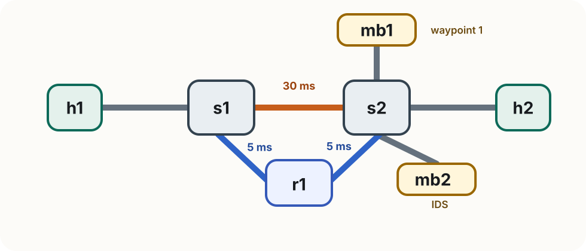

<!-- _class: title -->

<span class="tag">Lab 3</span>

# Path Steering with SRv6

Rogers Executive Workshop 3 — Transport Network

---

# Lab 3 at a glance

In this lab you will:

- establish baseline IPv6 reachability across the topology
- use an SRv6 segment list to force traffic through two service waypoints before it reaches the destination
- build the reverse service chain as an exercise
- optionally, if time, use the same idea to move traffic onto a lower-latency alternate path

> **What to focus on** The core idea is SRv6 itself: the segment list expresses the path you want. In the main lab, that means service waypoints. If time permits, the optional extension uses the same idea to move traffic onto a lower-latency path.

---

# One forwarding check

The switched fabric from Lab 2 is still providing the baseline forwarding underneath this lab. Because SRv6 creates an outer IPv6 packet, that baseline fabric must already carry IPv6 traffic correctly.

The ONOS install should already have this enabled. Check it in the ONOS CLI:

```text
onos> cfg get org.onosproject.fwd.ReactiveForwarding
```

Look for `ipv6Forwarding` in the output — it should show `true`.

> **Why this matters** SRv6 adds an outer IPv6 header around the packet. This check simply confirms the existing fabric will carry that outer IPv6 packet correctly.

---

# Lab 3 topology

<div class="topology-figure compact">
  
</div>

| Node | Role                | IPv4     | SRv6 SID                          |
| ---- | ------------------- | -------- | --------------------------------- |
| h1   | Traffic source      | 10.0.0.1 | fc00::1                           |
| h2   | Traffic destination | 10.0.0.2 | fc00::2                           |
| mb1  | Waypoint 1          | 10.0.0.3 | fc00::b1                          |
| mb2  | IDS / waypoint 2    | 10.0.0.4 | fc00::b2                          |
| r1   | SRv6 router         | 10.0.0.5 | fc00::a1 (eth0) / fc00::a2 (eth1) |

The topology has a direct path between the two switches and an alternate path through `r1`, which we will use later in the optional exercise.

> **Why two SIDs on r1?** `r1` has one SID per interface. Using the s1-facing SID or the s2-facing SID lets the segment list enter `r1` from the correct side, which matters when we later steer the forward and reverse directions differently.

---

<!-- _class: compact -->

# Before you start

**First: clean up Lab 2 completely.**

1. Exit any running Mininet (`Ctrl+D` or `exit` in the Mininet terminal)
2. Run `sudo mn -c` in a terminal
3. Close all Lab 2 terminals

Then open **five fresh terminals**.

**In every terminal, start in the Lab 3 folder:**

```bash
cd ~/labs/lab3
```

| Terminal           | Purpose                                    |
| ------------------ | ------------------------------------------ |
| 1 — Mininet        | start topology, run host commands          |
| 2 — ONOS CLI       | check apps, config, and flows              |
| 3 — h2 HTTP server | `./run_h2_http_server.sh`                  |
| 4 — mb2 IDS        | `./run_mb2_ids.sh`                         |
| 5 — Shell          | `configure_srv6.py`, `exercises/verify.py` |

---

<!-- _class: divider -->

# Step 1 — Prepare the baseline network

Baseline forwarding first, then SRv6 steering

---

# Start the topology

From `~/labs/lab3/`, start Mininet (terminal 1):

```bash
sudo python3 topology.py
```

The switches connect to ONOS over OpenFlow 1.3. You should see:

```text
[Controller] Connecting to ONOS at 127.0.0.1:6653
```

Connect to the ONOS CLI (terminal 2):

```bash
ssh -p 8101 -o HostKeyAlgorithms=+ssh-rsa onos@localhost
# password: rocks
```

---

<!-- _class: compact -->

# Check the baseline fabric prerequisites (1/2)

From the ONOS CLI, verify the required apps are active:

```text
onos> apps -s -a
```

You should see these three in the list:

```text
org.onosproject.openflow
org.onosproject.fwd
org.onosproject.proxyarp
```

---

<!-- _class: compact -->

# Check the baseline fabric prerequisites (2/2)

Then verify that IPv6 forwarding is enabled in `fwd`:

```text
onos> cfg get org.onosproject.fwd.ReactiveForwarding
```

Look for `ipv6Forwarding` in the output — it should show `true`.

Confirm both switches connected:

```text
onos> devices
```

You should see `s1` and `s2` with `local-status=connected`.

> **The current ONOS install should already have `ipv6Forwarding=true`** If it does not, IPv6 pings to SIDs and the outer SRv6 packets will fail to traverse the switches correctly.

---

# Verify the baseline path

Before adding any SRv6 state, confirm the plain network works end to end:

```text
mininet> pingall
```

Check that the hosts were learned and the baseline forwarding rules were installed:

```text
onos> hosts
onos> flows
```

> **Expected** All four hosts appear, and `fwd` has installed ETH_DST-based rules on both switches. This gives you a working baseline fabric before SRv6 starts steering packets.

---

<!-- _class: divider -->

# Step 2 — SRv6 Setup

Now configure the SIDs used in this lab

---

# Set up SRv6 on every host

From terminal 5:

```bash
python3 configure_srv6.py
```

This applies the same three-step pattern on each host:

```text
sysctl -w net.ipv6.conf.all.forwarding=1
sysctl -w net.ipv6.conf.all.seg6_enabled=1
sysctl -w net.ipv6.conf.<iface>.seg6_enabled=1
ip -6 addr add <SID>/128 dev <iface>
```

| Host  | SID                                   | Note                              |
| ----- | ------------------------------------- | --------------------------------- |
| `h1`  | `fc00::1`                             |                                   |
| `h2`  | `fc00::2`                             |                                   |
| `mb1` | `fc00::b1`                            |                                   |
| `mb2` | `fc00::b2`                            |                                   |
| `r1`  | `fc00::a1` (eth0) / `fc00::a2` (eth1) | dual-homed, one SID per interface |

---

# Verify SID reachability — the key prerequisite

Can the switched fabric carry IPv6 packets to every SID?

```text
mininet> h1 ping6 -c 2 fc00::2     # h1 → h2
mininet> h1 ping6 -c 2 fc00::b1    # h1 → mb1
mininet> h1 ping6 -c 2 fc00::b2    # h1 → mb2
mininet> h1 ping6 -c 2 fc00::a1    # h1 → r1
```

> **Expected: all four succeed.** Once IPv6 forwarding is enabled, the baseline fabric reacts to the first IPv6 packet from each host and installs ordinary ETH_DST-based rules. The switches never need to understand the SID or the SRH.

If any ping6 fails, check ONOS flows:

```text
onos> flows
```

---

<!-- _class: compact -->

# Optional check — IPv6 forwarding rules appear

After the ping6 tests, inspect the flows on `s2`:

```bash
sudo ovs-ofctl dump-flows s2 -O OpenFlow13
```

With `ipv6Forwarding true`, you will see IPv6-scoped forwarding rules alongside the IPv4 ones:

```text
priority=10, ipv6, ...
```

You do not need to study the exact rule fields for this lab. The important point is simply that, after the `ping6` tests, the baseline fabric has learned how to carry the outer IPv6 packets used by SRv6.

If you want, you can confirm the forwarding setting again with:

```text
onos> cfg get org.onosproject.fwd.ReactiveForwarding
```

Look for `ipv6Forwarding` — it should still show `true`.

---

<!-- _class: divider -->

# Step 3 — Service Chain

Use SRv6 to force traffic through the waypoints

---

# Baseline — confirm bypass before steering

Start the services first:

```bash
# terminal 3
./run_h2_http_server.sh

# terminal 4
./run_mb2_ids.sh
```

Send a suspicious request before adding any route:

```text
mininet> h1 curl http://10.0.0.2/malware
```

> **Expected** `h2` responds and `mb2` prints nothing — traffic takes the direct path and bypasses the IDS.

---

# Program the service chain

On `h1`, install an SRv6 encap route that names `mb1`, then `mb2`, then `h2`:

```text
mininet> h1 ip route add 10.0.0.2 encap seg6 mode encap segs fc00::b1,fc00::b2,fc00::2 dev h1-eth0
```

The segment list is what makes the packet visit `mb1`, then `mb2`, then `h2`.

---

<!-- _class: compact -->

# Test the service chain

Send a normal request and watch terminal 4:

```text
mininet> h1 curl http://10.0.0.2/index.html
```

```text
[HH:MM:SS] [mb2 IDS] [OK]    10.0.0.1 → 10.0.0.2 — GET /index.html HTTP/1.1
```

Send a suspicious one:

```text
mininet> h1 curl http://10.0.0.2/malware
```

```text
[HH:MM:SS] [mb2 IDS] [ALERT] 10.0.0.1 → 10.0.0.2 — GET /malware HTTP/1.1
```

> **It works.** The segment list forced traffic through `mb1` and `mb2` before delivery to `h2`.

---

# What the SRH does

The SRH carries the path you want:

```text
Outer IPv6 src: fc00::1  dst: fc00::b1
SRH segments:   fc00::b1 → fc00::b2 → fc00::2
Inner IPv4:     10.0.0.1 → 10.0.0.2
```

> **Key point** The SRH is what expresses the service chain. Once you write the segment list, the packet is carried hop by hop through the network and visits the waypoints in that order.

---

<!-- _class: divider -->

# Exercise

Build the reverse service chain yourself

---

<!-- _class: independent compact -->

# Exercise — Tasks

Install the reverse SRv6 route so `h2 → mb2 → mb1 → h1`:

1. **Fill in the two blanks** in `exercises/reverse_route.sh`, then run:

   ```bash
   sudo bash exercises/reverse_route.sh
   ```

2. **Verify:**

   ```bash
   sudo python3 exercises/verify.py
   ```

> **Stuck?** Compare with `solutions/reverse_route.sh`

---

<!-- _class: independent -->

# Optional Exercise

If time, extend the same service chain onto the lower-latency path.

> Even if we do not cover this part live, we will come back to the same idea in Lab 4.

---

<!-- _class: independent -->

# Recap the topology for the optional exercise

<div class="topology-figure compact">
  
</div>

> The direct `s1-s2` link is slower (`30 ms`). The alternate path through `r1` is faster (`5 ms + 5 ms`). The optional exercise is to keep the same service chain while moving traffic onto that faster path.

---

<!-- _class: independent -->

# Exercise 2 — Alternate Path via r1

Optional independent exercise: use SRv6 to choose the lower-latency path

---

<!-- _class: independent -->

# Baseline latency — the direct path

Without any SRv6 route, traffic follows the ordinary direct `s1-s2` path. That link carries **30 ms** of delay.

Remove any existing route on `h1`, then measure:

```text
mininet> h1 ip route del 10.0.0.2
mininet> h1 ping -c 5 10.0.0.2
```

```text
rtt min/avg/max = 60.x/60.x/60.x ms
```

> **~60 ms RTT** — 30 ms each way on the direct link. This is the path you get before SRv6 steering changes anything.

---

<!-- _class: independent -->

# Add r1 as the ingress segment

Install a new SRv6 route that puts `r1` first in the segment list:

```text
mininet> h1 ip route add 10.0.0.2 encap seg6 mode encap segs fc00::a1,fc00::b1,fc00::b2,fc00::2 dev h1-eth0
```

What changes:

```text
Before:  h1 ──[30ms]──> s1 ──[30ms]──> s2 → mb1 → mb2 → h2
After:   h1 → s1 ──[5ms]──> r1 ──[5ms]──> s2 → mb1 → mb2 → h2
```

The outer SRv6 packet first travels `s1 → r1` (5 ms), then `r1 → s2` (5 ms). The slow `s1-s2` direct link is never used.

---

<!-- _class: independent -->

# Measure the alternate path

```text
mininet> h1 ping -c 5 10.0.0.2
```

```text
64 bytes icmp_seq=1 time=79.x ms   ← first packet: reactive forwarding installs new rules
64 bytes icmp_seq=2 time=20.x ms
64 bytes icmp_seq=3 time=20.x ms
64 bytes icmp_seq=4 time=20.x ms
64 bytes icmp_seq=5 time=20.x ms
```

The first packet is slow because reactive forwarding has not seen the new outer flow yet, so rules are installed on both switches before forwarding. From seq=2 onwards, the rules are cached and the path shows its true latency.

> **~20 ms steady-state RTT** — down from 60 ms. Two 5 ms legs (s1→r1, r1→s2) each way. The segment list moved traffic off the slow direct link and onto the faster alternate path.

Confirm `mb2` still sees the traffic (service chain is intact):

```text
[HH:MM:SS] [mb2 IDS] [OK]    10.0.0.1 → 10.0.0.2 — GET /index.html HTTP/1.1
```

---

<!-- _class: independent -->

# Add the reverse path through r1

The return path `h2 → h1` still uses the direct `s1-s2` link. Install the reverse SRv6 route on `h2`, using `fc00::a2` — the SID assigned to r1's **eth1** (s2-facing interface):

```text
mininet> h2 ip route add 10.0.0.1 encap seg6 mode encap segs fc00::b2,fc00::b1,fc00::a2,fc00::1 dev h2-eth0
```

Segment order for the reverse chain:

```text
h2 → mb2 (fc00::b2) → mb1 (fc00::b1) → r1-eth1 (fc00::a2) → h1 (fc00::1)
```

> **Why `fc00::a2` and not `fc00::a1`?** `fc00::a1` lives on r1's s1-facing interface. Sending to it from `mb1` would send traffic back toward the slow `s2 → s1` side first. `fc00::a2` lives on r1's s2-facing interface, so `mb1` reaches `r1` directly over the 5 ms leg.

---

<!-- _class: independent compact -->

# Verify both directions

Ping from `h1` to confirm the forward path still routes through `r1`:

```text
mininet> h1 ping -c 5 10.0.0.2
```

Ping from `h2` to confirm the reverse path also routes through `r1`:

```text
mininet> h2 ping -c 5 10.0.0.1
```

Both should show ~20 ms RTT. You can also capture on `r1` to confirm it sees traffic in both directions:

```bash
./enter_host.sh r1
tshark -i r1-eth0 -i r1-eth1 -Y "ipv6.routing.type == 4" -c 4
```

> **Expected**: two SRv6 packets on `r1-eth0` (from s1) and two on `r1-eth1` (toward s2), one per direction per ping.

---

<!-- _class: independent compact -->

# Troubleshooting

| Symptom                              | Fix                                                                                        |
| ------------------------------------ | ------------------------------------------------------------------------------------------ |
| `devices` empty after topology start | wait a few seconds, retry; confirm ONOS is running                                         |
| `pingall` fails entirely             | check `onos> apps -s -a` — openflow and fwd must be active                                 |
| `ping6 fc00::2` fails                | check `cfg get org.onosproject.fwd.ReactiveForwarding` — `ipv6Forwarding` should be `true` |
| `flows` shows only IPv4 rules        | same as above — verify `ipv6Forwarding` is enabled in the ONOS config                      |
| IDS log empty after steering         | confirm the route uses `mode encap` and includes `fc00::b2`                                |
| `flows` empty after pingall          | fwd or proxyarp may not be active — check ONOS apps and retry                              |

---

# Summary

In this lab you confirmed that:

- an SRv6 segment list can force traffic through explicit waypoints before it reaches the destination
- the existing network fabric can carry the outer IPv6 packets used by SRv6
- the reverse direction needs its own segment list as well

> **Optional extension** If you continued to Exercise 2, adding `r1` as a segment moved traffic onto the lower-latency path and cut RTT from about 60 ms to about 20 ms.

> **Key insight** SRv6 keeps the path decision in the segment list. In this lab that lets you express the service chain, and in the optional extension it also lets you express the lower-latency alternate path.
