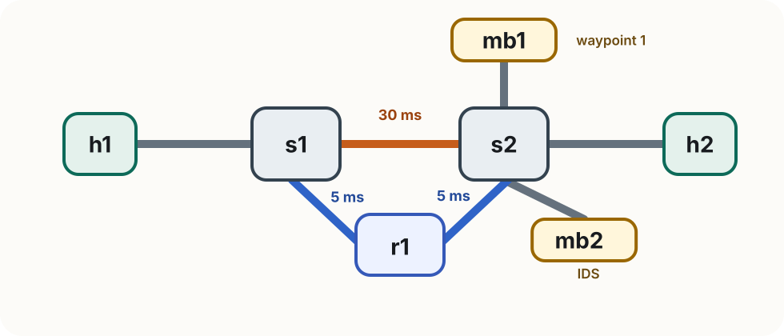

<!-- _class: title -->

<span class="tag">Lab 3b</span>

# SRv6 Service Chaining
# with ONOS

Rogers Executive Workshop 3 — Transport Network

---

<!-- _class: divider -->

# What We Are Testing

Can Lab 3's SRv6 service chain run with ONOS controlling the switches?

---

# Lab 3b at a glance

In this lab you will:

- connect the topology to ONOS and use a dual-homed Linux router (`r1`) as a faster alternate path between `s1` and `s2`
- confirm that ONOS's reactive forwarding handles IPv6 traffic
- run the SRv6 service chain through `mb1` and `mb2`
- add `r1` to the segment list and observe latency drop from ~60 ms to ~20 ms
- steer the reverse path through `r1` as well

> **New this lab** The direct `s1-s2` link carries 30 ms of artificial delay. The alternate path through `r1` (5 ms each leg) is faster — but ONOS's hop-count routing always prefers the direct link. SRv6 lets you override that choice.

---

# Why we need extra configuration

ONOS's `fwd` app is purely **L2** — its selector is `IN_PORT + ETH_TYPE + ETH_SRC + ETH_DST`. No IP addresses. All the `matchIpv4Address`, `matchIpv6Address`, etc. flags default to `false`.

By default `fwd` only intercepts `ETH_TYPE:ipv4` packets. IPv6 PacketIn events are ignored, so no rules are ever installed for `ping6` to SRv6 SIDs or for the outer SRv6 IPv6 frames.

The fix is one flag that adds `ETH_TYPE:ipv6` to the set of intercepted EtherTypes:

```text
onos> cfg set org.onosproject.fwd.ReactiveForwarding ipv6Forwarding true
```

Verify it took effect:

```text
onos> cfg get org.onosproject.fwd.ReactiveForwarding
```

> **`ipv6Forwarding` only changes which EtherTypes are intercepted** — the installed rules still match on `ETH_TYPE + ETH_SRC + ETH_DST`. This is ideal for SRv6: the switch matches on ETH_DST (next-hop MAC) and never needs to parse the IPv6 header or the SRH.

---

# Lab 3b topology

<div class="topology-figure compact">
  
</div>

| Node | Role                | IPv4     | SRv6 SID  |
| ---- | ------------------- | -------- | --------- |
| h1   | Traffic source      | 10.0.0.1 | fc00::1   |
| h2   | Traffic destination | 10.0.0.2 | fc00::2   |
| mb1  | Waypoint 1          | 10.0.0.3 | fc00::b1  |
| mb2  | IDS / waypoint 2    | 10.0.0.4 | fc00::b2  |
| r1   | SRv6 router         | 10.0.0.5 | fc00::a1 (eth0) / fc00::a2 (eth1) |

Switches `s1` and `s2` use **OpenFlow13** and connect to ONOS at `127.0.0.1:6653`. `r1` is a dual-homed Linux host (eth0 → s1, eth1 → s2). Link delays: s1-s2 = **30 ms**, s1-r1 = r1-s2 = **5 ms**.

> **Why two SIDs on r1?** ONOS associates each SID with the switch where it was learned. `fc00::a1` is learned from s1, so packets to it route via s1. `fc00::a2` is learned from s2, so packets to it route via s2. Using the correct SID in each direction keeps both paths on the 5 ms links.

---

<!-- _class: compact -->

# Before you start

**First: clean up Lab 3 completely.**

1. Exit any running Mininet (`Ctrl+D` or `exit` in the Mininet terminal)
2. Run `sudo mn -c` in a terminal
3. Close all Lab 3 terminals

Then open **five fresh terminals**.

**In every terminal, start in the Lab 3b folder:**

```bash
cd ~/labs/lab3b
```

| Terminal           | Purpose                                    |
| ------------------ | ------------------------------------------ |
| 1 — Mininet        | start topology, run host commands          |
| 2 — ONOS CLI       | activate apps, inspect flows               |
| 3 — h2 HTTP server | `./run_h2_http_server.sh`                  |
| 4 — mb2 IDS        | `./run_mb2_ids.sh`                         |
| 5 — Shell          | `configure_srv6.py`, `exercises/verify.py` |

---

<!-- _class: divider -->

# Step 1 — Connect to ONOS

Same as Lab 2

---

# Start the topology

Make sure ONOS is running, then start Mininet (terminal 1):

```bash
sudo python3 topology.py
```

The switches connect to ONOS over OpenFlow 1.3. You should see:

```text
[Controller] Connecting to ONOS at 127.0.0.1:6653
```

Connect to the ONOS CLI (terminal 2):

```bash
ssh -p 8101 -o HostKeyAlgorithms=+ssh-rsa onos@localhost
# password: rocks
```

---

# Activate the required apps

Same three apps as Lab 2, plus one extra configuration flag:

```text
onos> app activate org.onosproject.openflow
onos> app activate org.onosproject.fwd
onos> app activate org.onosproject.proxyarp
```

Then enable IPv6 forwarding on `fwd`:

```text
onos> cfg set org.onosproject.fwd.ReactiveForwarding ipv6Forwarding true
```

Confirm both switches connected:

```text
onos> devices
```

You should see `s1` and `s2` with `local-status=connected`.

> **Without `ipv6Forwarding true`**, the fwd app only installs IPv4 rules. IPv6 pings to SIDs and the outer SRv6 packets will fail to traverse the switches.

---

# Verify IPv4 connectivity

Trigger host discovery and confirm ONOS installs forwarding rules:

```text
mininet> pingall
```

Check that ONOS learned the hosts and wrote the rules:

```text
onos> hosts
onos> flows
```

> **Expected** All four hosts appear, and `fwd` has installed ETH_DST-based rules on both switches. This confirms the ONOS-controlled baseline works before adding SRv6.

---

<!-- _class: divider -->

# Step 2 — SRv6 Setup

Same as Lab 3 — configure SIDs on the hosts, not the switches

---

# Set up SRv6 on every host

From terminal 5:

```bash
python3 configure_srv6.py
```

This applies the same three-step pattern on each host:

```text
sysctl -w net.ipv6.conf.all.forwarding=1
sysctl -w net.ipv6.conf.all.seg6_enabled=1
sysctl -w net.ipv6.conf.<iface>.seg6_enabled=1
ip -6 addr add <SID>/128 dev <iface>
```

| Host  | SID        | Note                          |
| ----- | ---------- | ----------------------------- |
| `h1`  | `fc00::1`  |                               |
| `h2`  | `fc00::2`  |                               |
| `mb1` | `fc00::b1` |                               |
| `mb2` | `fc00::b2` |                               |
| `r1`  | `fc00::a1` (eth0) / `fc00::a2` (eth1) | dual-homed, one SID per interface |

---

# Verify SID reachability — the key test

Can ONOS-managed switches forward IPv6 ping to the SIDs?

```text
mininet> h1 ping6 -c 2 fc00::2     # h1 → h2
mininet> h1 ping6 -c 2 fc00::b1    # h1 → mb1
mininet> h1 ping6 -c 2 fc00::b2    # h1 → mb2
mininet> h1 ping6 -c 2 fc00::a1    # h1 → r1
```

> **Expected: all four succeed.** ONOS's fwd app reacts to the first IPv6 packet from each host, learns the source MAC, and installs an ETH_DST-based rule. Subsequent packets are forwarded by that rule — the fact that the payload is IPv6 is invisible to the switch.

If any ping6 fails, check ONOS flows:

```text
onos> flows
```

---

<!-- _class: compact -->

# What ONOS installed for IPv6

After the ping6 tests, inspect the flows on `s2`:

```bash
sudo ovs-ofctl dump-flows s2 -O OpenFlow13
```

With `ipv6Forwarding true`, you will see IPv6-scoped L2 rules alongside the IPv4 ones:

```text
priority=10, ipv6,
  in_port="s2-eth4", dl_src=00:00:00:00:00:01, dl_dst=00:00:00:00:00:03
  actions=output:"s2-eth2"
```

The selector is `ETH_TYPE:ipv6 + IN_PORT + ETH_SRC + ETH_DST` — no IPv6 addresses anywhere. You can confirm the match flags with:

```text
onos> cfg get org.onosproject.fwd.ReactiveForwarding
```

All `matchIpv6Address`, `matchIpv4Address`, etc. will show `value=false`.

---

<!-- _class: divider -->

# Step 3 — Service Chain

Same SRv6 steering commands as Lab 3

---

# Baseline — confirm bypass before steering

Start the services first:

```bash
# terminal 3
./run_h2_http_server.sh

# terminal 4
./run_mb2_ids.sh
```

Send a suspicious request before adding any route:

```text
mininet> h1 curl http://10.0.0.2/malware
```

> **Expected** `h2` responds and `mb2` prints nothing — traffic takes the direct path and bypasses the IDS. This baseline is identical to Lab 3.

---

# Program the service chain

On `h1`, install the same SRv6 encap route as in Lab 3:

```text
mininet> h1 ip route add 10.0.0.2 encap seg6 mode encap segs fc00::b1,fc00::b2,fc00::2 dev h1-eth0
```

The outer SRv6 packet is now an IPv6 frame — ONOS's fwd app will handle it exactly like a regular IPv6 packet, forwarding it based on the MAC of `mb1`.

---

<!-- _class: compact -->

# Test the service chain

Send a normal request and watch terminal 4:

```text
mininet> h1 curl http://10.0.0.2/index.html
```

```text
[HH:MM:SS] [mb2 IDS] [OK]    10.0.0.1 → 10.0.0.2 — GET /index.html HTTP/1.1
```

Send a suspicious one:

```text
mininet> h1 curl http://10.0.0.2/malware
```

```text
[HH:MM:SS] [mb2 IDS] [ALERT] 10.0.0.1 → 10.0.0.2 — GET /malware HTTP/1.1
```

> **It works.** ONOS-managed switches forward the SRv6 outer packet to `mb1`, then to `mb2`, then to `h2` — using the same MAC-based flow rules that handle ordinary IPv4. The controller does not need to know about SRv6 at all.

---

# What ONOS sees vs. what the SRH does

ONOS's perspective — a pure L2 rule for the first hop:

```text
ETH_TYPE:ipv6, ETH_SRC:h1_mac, ETH_DST:mb1_mac → output: port-to-mb1
```

The SRH's perspective — a steered IPv6 packet:

```text
Outer IPv6 src: fc00::1  dst: fc00::b1
SRH segments:   fc00::b1 → fc00::b2 → fc00::2
Inner IPv4:     10.0.0.1 → 10.0.0.2
```

> **ONOS only sees the Ethernet header.** The IPv6 addresses, extension headers, and SRH are all invisible to the switch's match logic. Path steering is entirely a host-level concern — ONOS just provides L2 forwarding scoped to IPv6 EtherType.

---

<!-- _class: divider -->

# Step 4 — Alternate Path via r1

Using SRv6 to override ONOS's routing decision

---

# Baseline latency — the direct path

Without any SRv6 route, ONOS forwards `h1 → h2` via the direct `s1-s2` link (one hop, lowest cost). That link carries **30 ms** of delay.

Remove any existing route on `h1`, then measure:

```text
mininet> h1 ip route del 10.0.0.2
mininet> h1 ping -c 5 10.0.0.2
```

```text
rtt min/avg/max = 60.x/60.x/60.x ms
```

> **~60 ms RTT** — 30 ms each way on the direct link. ONOS chose this path because it has the fewest hops, ignoring the delay.

---

# Add r1 as the ingress segment

Install a new SRv6 route that puts `r1` first in the segment list:

```text
mininet> h1 ip route add 10.0.0.2 encap seg6 mode encap segs fc00::a1,fc00::b1,fc00::b2,fc00::2 dev h1-eth0
```

What changes:

```text
Before:  h1 ──[30ms]──> s1 ──[30ms]──> s2 → mb1 → mb2 → h2
After:   h1 → s1 ──[5ms]──> r1 ──[5ms]──> s2 → mb1 → mb2 → h2
```

The outer SRv6 packet first travels `s1 → r1` (5 ms), then `r1 → s2` (5 ms). The slow `s1-s2` direct link is never used.

---

# Measure the alternate path

```text
mininet> h1 ping -c 5 10.0.0.2
```

```text
64 bytes icmp_seq=1 time=79.x ms   ← first packet: ONOS installs new rules
64 bytes icmp_seq=2 time=20.x ms
64 bytes icmp_seq=3 time=20.x ms
64 bytes icmp_seq=4 time=20.x ms
64 bytes icmp_seq=5 time=20.x ms
```

The first packet is slow because ONOS has never seen the new `fc00::a2` flow — it installs rules reactively on both switches before forwarding. From seq=2 onwards, the rules are cached and the path shows its true latency.

> **~20 ms steady-state RTT** — down from 60 ms. Two 5 ms legs (s1→r1, r1→s2) each way. ONOS still considers the direct link optimal by hop count; SRv6 overrides that entirely at the host.

Confirm `mb2` still sees the traffic (service chain is intact):

```text
[HH:MM:SS] [mb2 IDS] [OK]    10.0.0.1 → 10.0.0.2 — GET /index.html HTTP/1.1
```

---

# Add the reverse path through r1

The return path `h2 → h1` still uses the direct `s1-s2` link. Install the reverse SRv6 route on `h2`, using `fc00::a2` — the SID assigned to r1's **eth1** (s2-facing interface):

```text
mininet> h2 ip route add 10.0.0.1 encap seg6 mode encap segs fc00::b2,fc00::b1,fc00::a2,fc00::1 dev h2-eth0
```

Segment order for the reverse chain:

```text
h2 → mb2 (fc00::b2) → mb1 (fc00::b1) → r1-eth1 (fc00::a2) → h1 (fc00::1)
```

> **Why `fc00::a2` and not `fc00::a1`?** `fc00::a1` is on r1-eth0, which ONOS learned from s1. Sending to it from mb1 (on s2) would route via the slow 30 ms s1-s2 link. `fc00::a2` is on r1-eth1, learned from s2, so mb1 reaches r1 directly in 5 ms.

---

<!-- _class: compact -->

# Verify both directions

Ping from `h1` to confirm the forward path still routes through `r1`:

```text
mininet> h1 ping -c 5 10.0.0.2
```

Ping from `h2` to confirm the reverse path also routes through `r1`:

```text
mininet> h2 ping -c 5 10.0.0.1
```

Both should show ~20 ms RTT. You can also capture on `r1` to confirm it sees traffic in both directions:

```bash
./enter_host.sh r1
tshark -i r1-eth0 -i r1-eth1 -Y "ipv6.routing.type == 4" -c 4
```

> **Expected**: two SRv6 packets on `r1-eth0` (from s1) and two on `r1-eth1` (toward s2), one per direction per ping.

---

<!-- _class: divider -->

# Exercise

Same as Lab 3 — add the reverse service chain

---

<!-- _class: independent compact -->

# Exercise — Tasks

Install the reverse SRv6 route so `h2 → mb2 → mb1 → h1`:

1. **Fill in the two blanks** in `exercises/reverse_route.sh`, then run:

   ```bash
   sudo bash exercises/reverse_route.sh
   ```

2. **Verify:**

   ```bash
   sudo python3 exercises/verify.py
   ```

> **Stuck?** Compare with `solutions/reverse_route.sh`

---

<!-- _class: independent compact -->

# Troubleshooting

| Symptom                              | Fix                                                                              |
| ------------------------------------ | -------------------------------------------------------------------------------- |
| `devices` empty after topology start | wait a few seconds, retry; confirm ONOS is running                               |
| `pingall` fails entirely             | check `onos> apps -a -s` — openflow and fwd must be active                       |
| `ping6 fc00::2` fails                | run `cfg set org.onosproject.fwd.ReactiveForwarding ipv6Forwarding true` in ONOS |
| `flows` shows only IPv4 rules        | same as above — `ipv6Forwarding` is off by default                               |
| IDS log empty after steering         | confirm the route uses `mode encap` and includes `fc00::b2`                      |
| `flows` empty after pingall          | fwd or proxyarp may not be active — re-activate and retry                        |

---

# Summary

In this lab you confirmed that:

- ONOS's `fwd` app is purely L2 (`ETH_TYPE + ETH_SRC + ETH_DST`) — no IP address matching regardless of flags
- By default it only intercepts `ETH_TYPE:ipv4`; enabling `ipv6Forwarding true` adds `ETH_TYPE:ipv6` to the intercepted set without changing the match fields
- Path steering is entirely a host-level operation — the controller never inspects or programs the SRH
- Combining ONOS control-plane visibility with host-level SRv6 steering is a valid architecture

> **Key insight** ONOS matches only on `ETH_TYPE + ETH_SRC + ETH_DST` — the SRH and the IPv6 addresses are invisible to the switch. SRv6 path decisions live entirely on the hosts, letting you override ONOS's hop-count routing with any path you choose.
