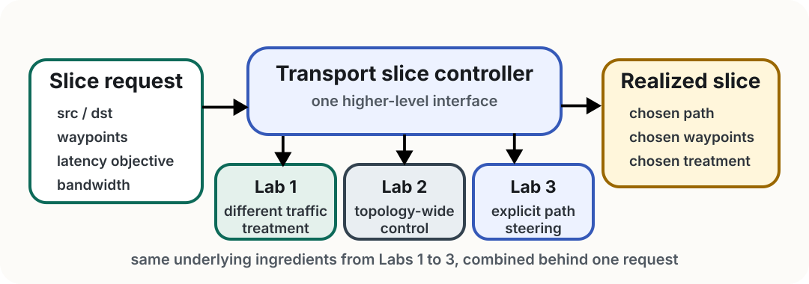
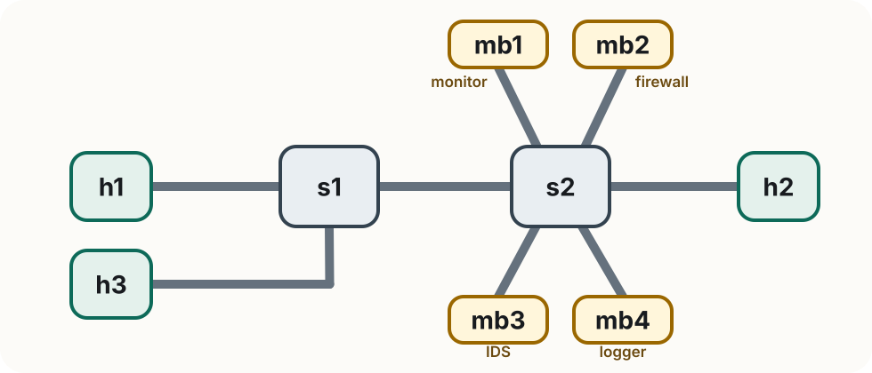

<!-- _class: title -->

<span class="tag">Lab 4</span>

# Putting it all together
# Transport Slicing

Rogers Executive Workshop 3 — Transport Network

---

<!-- _class: divider -->

# Getting Started

What this lab teaches and how to work through it

---

# Lab 4 at a glance

In this lab you will:

- observe how contention on a shared bottleneck degrades **both** bandwidth and latency
- run one guided demo of a transport slice
- express slice requirements by editing a short `SLICE_REQUEST` block
- ask for a low-latency path, a service chain, and an admissible bandwidth request
- watch the controller realize each request automatically

> **What to focus on** Nothing here is a new transport mechanism. Lab 4 puts together the ideas from Labs 1 to 3 behind one higher-level interface: you describe the slice you want, and the transport slice controller realizes it.

---

<!-- _class: compact -->

# From earlier labs to Lab 4

- **Lab 1** showed that the network does not have to treat every flow the same way. Transport can give different traffic different treatment.
- **Lab 2** added the control-plane view. Instead of configuring one device in isolation, we can realize policy across a topology.
- **Lab 3** added explicit path control. Traffic does not have to follow the default path; it can be steered through chosen waypoints and along a chosen route.
- **Lab 4** turns those ideas into one abstraction: a **transport slice** is a service request that asks for both a path and a treatment.

> **Putting it together** Nothing in this lab is conceptually new in the data plane. The transport slice controller is the "putting it together" piece: it takes the mechanisms you already used in Labs 1 to 3 and realizes them together from one higher-level request.

---

<!-- _class: compact -->

# How the controller puts it together

<div class="slide-figure">
  
</div>

> **High level** The request is new. The underlying ingredients are the same ones you already used in the earlier labs.

---

# Lab 4 topology

<div class="topology-figure compact">
  
</div>

`h1` source · `h2` destination · `h3` competing flow · `mb1` telemetry · `mb2` security · `r1` alternate-path router

> **Key idea** The direct `s1→s2` path is slower and bandwidth-limited. The `r1` path is faster and uncongested, but ONOS does not choose it by default.

---
# What the middleboxes do

**`mb1` — telemetry monitor**
Reports observed throughput of traffic that visits it.
Its log lighting up confirms traffic really took the requested waypoint.

**`mb2` — security inspector**
Inspects the inner flow and reports `[OK]` or `[ALERT]`.
It gives Exercise 2 a clearly different service function from Exercise 1.

> The middlebox logs are part of the lesson. If a log lights up, the slice's waypoint requirement is being realized.

---

# What a slice request looks like

The transport slice controller uses the same mechanisms you learned in Labs 1 to 3, but it exposes a higher-level interface. Instead of configuring each mechanism separately, every exercise asks you to edit one `SLICE_REQUEST` block in a `slice_request.py` file:

```python
SLICE_REQUEST = {
    "name":               "express",
    "src":                "h1",
    "dst":                "h2",
    "latency_objective":  "standard",   # "standard" | "low"
    "bandwidth_mbps":     0,            # 0 = best-effort, 1–10 = reserved
    "waypoints":          ["mb1"],      # [] | ["mb1"] | ["mb2"] | ["mb1","mb2"]
}
```

> **What changes in Lab 4 is the interface** You are not editing the queueing, ONOS, or SRv6 logic directly. You describe the slice you want in one request, and the controller realizes it using those same underlying mechanisms.

---

<!-- _class: compact -->

# Before you start (1/2)

**First: clean up Lab 3 completely.**

1. Exit any running Mininet (`Ctrl+D` or `exit` in the Mininet terminal)
2. Run `sudo mn -c` in a terminal
3. Close all Lab 3 terminals

Then work from:

```bash
cd ~/labs/lab4
```

> **Stay in `labs/lab4` for every command in this lab.**

Make sure ONOS is running. As done previously, open the ONOS CLI from a new terminal using `ssh`:

```bash
ssh -p 8101 -o HostKeyAlgorithms=+ssh-rsa onos@localhost
# password: rocks
```

---

<!-- _class: compact -->

# Before you start (2/2)

From the ONOS CLI, verify the required apps are active:

```text
onos> apps -s -a
```

You should see these three in the list:

```text
org.onosproject.openflow
org.onosproject.fwd
org.onosproject.proxyarp
```

Then verify that IPv6 forwarding is enabled in `fwd`:

```text
onos> cfg get org.onosproject.fwd.ReactiveForwarding
```

Look for `ipv6Forwarding` in the output — it should show `true`. If it does not, the switches will not forward SRv6 packets correctly.

---

<!-- _class: divider -->

# The Demo

One guided example before the exercises

---

# Run the demo

From `~/labs/lab4`:

```bash
sudo python3 demo/run.py
```

The demo uses a **fixed** request in `demo/slice_request.py` — you will be asked to open and read it, but not edit it.

The runner walks through four phases and pauses at each one. Follow along in the log files.

---

<!-- _class: divider -->

# Exercises

---

# How exercises work

1. From `~/labs/lab4`, run:
   ```bash
   sudo python3 exercises/partX/run.py
   ```
2. The runner starts the network, configures SRv6, and starts traffic automatically — so you can **see the problem first**
3. When the runner pauses, open `exercises/partX/slice_request.py` and edit the `SLICE_REQUEST` block
4. Press ENTER — the runner reloads your file and validates it
5. The slice is applied and you observe the effect
6. The slice is torn down so you can see the behavior revert

If a request is invalid or rejected, the runner prints the error and waits for you to edit and retry.

> The file already contains the full schema with valid values for every field — you do not need to look anything up elsewhere.

---

<!-- _class: compact -->

# Exercise 1 — Low-latency path

> ⚠️ **Before starting:** `mininet> exit` → `sudo mn -c` → `cd ~/labs/lab4`

**Goal:** ask for a lower-latency service from `h1` to `h2` while keeping the telemetry monitor in the chain.

The runner shows you contention first, then asks you to edit `exercises/part1/slice_request.py`.

```bash
sudo python3 exercises/part1/run.py
```

> Solution: `solutions/part1/slice_request.py`

Watch these logs:

```bash
tail -F /tmp/iperf_h1.log
tail -F /tmp/iperf_h3.log
tail -F /tmp/ping_h1_h2.log
tail -F /tmp/mb1_bandwidth.log
```

---

<!-- _class: compact -->

# Exercise 2 — Service chain

> ⚠️ **Before starting:** `mininet> exit` → `sudo mn -c` → `cd ~/labs/lab4`

**Goal:** keep the standard path and best-effort bandwidth, but route traffic through both middleboxes in this order:

```text
telemetry monitor → security inspector → destination
```

The runner starts traffic first, then asks you to edit `exercises/part2/slice_request.py`.

```bash
sudo python3 exercises/part2/run.py
```

Watch these logs:

```bash
tail -F /tmp/iperf_h1.log
tail -F /tmp/iperf_h3.log
tail -F /tmp/mb1_bandwidth.log
tail -F /tmp/mb2_security.log
```

---

<!-- _class: compact -->

# Exercise 3 — Admission control

> ⚠️ **Before starting:** `mininet> exit` → `sudo mn -c` → `cd ~/labs/lab4`

The runner installs a fixed 8 Mbps slice for `h1`, then asks you to submit a competing request for `h3`. It retries until your request is admitted.

```bash
sudo python3 exercises/part3/run.py   # edit exercises/part3/slice_request.py when prompted
```

This controller uses first-come-first-served: the baseline slice keeps its reservation and your request is evaluated only against what remains. That raises a useful question — **what if the second request were actually more important?** A smarter controller might weigh priority, preemption, or SLA tier.

Further reading: M. Sulaiman et al., *Coordinated Slicing and Admission Control using Multi-Agent Deep Reinforcement Learning*, IEEE TNSM, 20(2), 2023.

---

<!-- _class: compact -->

# Troubleshooting

**The runner hangs or pingAll fails at startup.**
Restart ONOS: `sudo docker restart onos`. Wait 2–3 minutes, then rerun.

**Switches are not forwarding traffic.**
Check that `ipv6Forwarding` is `true`: `cfg get org.onosproject.fwd.ReactiveForwarding`

**The request file won't load.**
Edit only the `SLICE_REQUEST` block and keep it a valid Python dictionary.

**A middlebox log stays silent.**
Confirm that middlebox is listed in `waypoints` in your request.

**The runner fails with `RTNETLINK answers: File exists` or similar.**
A previous Mininet run was not cleaned up. Run `sudo mn -c` and restart from `~/labs/lab4`.

---

# Summary

Lab 4 is where Labs 1–3 come together to illustrate the **concepts** behind simple transport slicing:

- **Lab 1** — programmable match/action rules steer traffic to the right queue
- **Lab 2** — an SDN controller translates one service request into concrete switch rules
- **Lab 3** — SRv6 steers traffic onto the right path and through the right waypoints

A single request expressing a path objective, a service chain, and a bandwidth guarantee — and a controller that realizes it.
